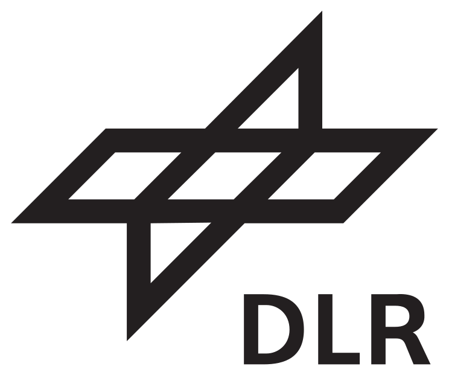
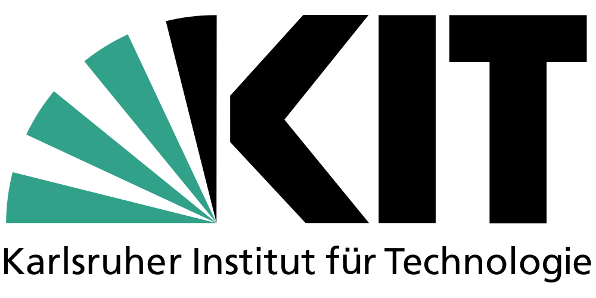

<p align="center">

</p>

# AI-enhanced differentiable Ray Tracer for Irradiation Prediction in Solar Tower Digital Twins

[](https://www.python.org/downloads/)
[](https://github.com/psf/black)
[](https://codecov.io/gh/ARTIST-Association/ARTIST)
[](artist@lists.kit.edu)
[](https://artist.readthedocs.io/en/latest/?badge=latest)

## What ``ARTIST`` can do for you

The ``ARTIST`` package provides an implementation of a differentiable ray tracer using the `PyTorch` machine-learning
framework in `Python`. Leveraging automatic differentiation and GPU computation, it facilitates the optimization of
heliostats, towers, and camera parameters within a solar field by combining gradient-based optimization methods with
smooth parametric descriptions of heliostats.

**Our contributions include:**

- **Neural-network driven heliostat calibration:** A two-layer hybrid model for most efficient heliostat calibration.
  It comprises a robust geometric model for pre-alignment and a neural network disturbance model, which gradually adapts
  its impact via regularization sweeps. On this way, high data requirements of data-centric methods are overcome while maintaining flexibility for modeling complex real-world systems.
  Check out [this paper](https://doi.org/10.1016/j.solener.2023.111962) for more details.

- **Surface reconstruction and flux density prediction:** Leveraging learning Non-Uniform Rational B-Splines (NURBS),
  `ARTIST` reconstructs heliostat surfaces accurately using calibration images commonly available in solar thermal power plants.
  Thus, we can achieve sub-millimeter accuracy in mirror reconstruction from focal spot images, contributing to improved
  operational safety and efficiency. The reconstructed surfaces can be used for predicting unique heliostat flux densities
  with state-of-the-art accuracy. Check out [this paper](https://doi.org/10.21203/rs.3.rs-2554998/v1) for more details.

- **Immediate deployment**: `ARTIST` enables deployment at the beginning of a solar thermal plant's operation,
  allowing for in situ calibration and subsequent improvements in energy efficiencies and cost reductions.

- **Optimized flux density:** Coming soon so stay tuned :rocket:!


## Installation
We heavily recommend installing the `ARTIST` package in a dedicated `Python3.8+` virtual environment. You can
install ``ARTIST`` directly from the GitHub repository via:
```bash
pip install git+https://github.com/ARTIST-Association/ARTIST
```
Alternatively, you can install ``ARTIST`` locally. To achieve this, there are two steps you need to follow:
1. Clone the `ARTIST` repository:
   ```bash
   git clone https://github.com/ARTIST-Association/ARTIST.git
   ```
2. Install the package from the main branch. There are multiple installation options available:
   - Install basic dependencies: ``pip install .``
   - Install with ``mpi4py`` to enable distributed computing: ``pip install ."[mpi]"``
   - Install with optional dependencies to run the tutorials:  ``pip install ."[tutorials]"``
   - Install an editable version with developer dependencies: ``pip install -e ."[dev]"``

## Structure
The ``ARTIST`` repository is structured as shown below:
```
.
├── artist # Parent package
│   ├── field # Objects in the field, e.g. heliostats and receivers
│   ├── raytracing
│   ├── scene # Light sources and factors influencing the surroundings
│   └── util
├── measurement_data # Real measurements that can be used in ARTIST
├── scenarios # Scenarios describing a field that can be loaded by ARTIST
├── tests/
│   ├── field
│   ├── raytracing
│   ├── scene
│   └── util
└── tutorials # Tutorials to help you get started with ARTIST
```

## Documentation
You can check out the full ``ARTIST`` documentation at [https://artist.readthedocs.io/en/latest/index.html](https://artist.readthedocs.io/en/latest/index.html) :rocket:!
The ``ARTIST`` documentation includes:
- Installation instructions
- Tutorials
- Some theoretical background information
- API reference

## How to contribute
Check out our [contribution guidelines](CONTRIBUTING.md) if you are interested in contributing to the `ARTIST` project :fire:.
Please also carefully check our [code of conduct](CODE_OF_CONDUCT.md) :blue_heart:.

## Acknowledgments
This work is supported by the [Helmholtz AI](https://www.helmholtz.ai/) platform grant.

-----------
<div align="center">
  <a href="https://www.dlr.de/EN/Home/home_node.html"></a>
  <a href="https://www.fz-juelich.de/portal/EN/Home/home_node.html"></a>
  <a href="http://www.kit.edu/english/index.php"></a>
  <a href="https://synhelion.com/"></a>
</div>

<div align="center">
<a href="https://www.helmholtz.ai/"></a>
</div>
