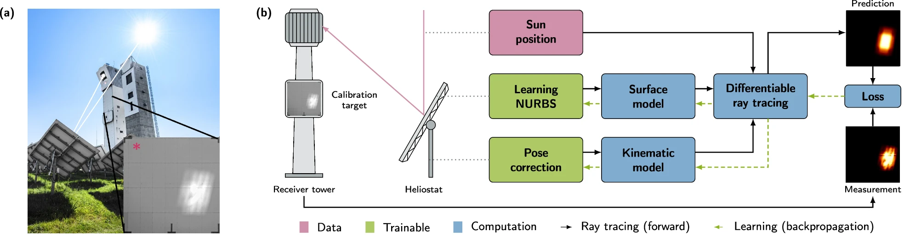

.. _artist_under_hood:

``ARTIST``: What's Happening Under The Hood?
============================================

Ray tracing in ``ARTIST`` models the propagation of sunlight through a solar tower power plant by following individual
light rays from the sun to the receiver. Each ray interacts with heliostat surfaces according to geometric optics,
allowing the resulting flux distribution on the receiver to be predicted from the physical configuration of the plant.

In contrast to conventional ray tracers, the ray tracer in ``ARTIST`` is fully differentiable. While conventional ray
tracing predicts the flux distribution for a given plant configuration in a `forward` computation, differentiability
allows changes in the flux distribution to be translated `backwards` into parameter updates through gradient-based
optimization. This enables efficient reconstruction and optimization of solar tower power plant models.

``ARTIST`` computes gradients of quantities defined on the predicted flux distribution with respect to model parameters
such as heliostat surface shapes, alignment parameters, or motor positions. These gradients are propagated through the
entire simulation using automatic differentiation, allowing discrepancies between simulated and measured flux
distributions to directly guide parameter updates during optimization.

   **a.** The CSP plant in Jülich, Germany. The heliostats, shown from behind, focus the sunlight on the receiver
   surface of the tower. Located below the receiver is the calibration target. The inset (\*) shows a focal spot image
   as taken during calibration. **b.** Schematic overview of the in-situ optimization with differentiable ray
   tracing for learning the heliostat parameters. Taken from M. Pargmann, J. Ebert, M. Götz et al. Automatic heliostat
   learning for in situ concentrating solar power plant metrology with differentiable ray tracing. Nat Commun 15, 6997
   (2024). https://doi.org/10.1038/s41467-024-51019-z

Differentiable ray tracing in ``ARTIST`` is designed to be robust, work effectively *in parallel*, and take advantage of
*GPU acceleration*. While most of our design decisions are handled automatically, a few points are worth noting. This
page provides a brief overview of some of the core principles governing how ``ARTIST`` handles processes and data
internally.

Coordinates
-----------

``ARTIST`` uses the *east, north, up (ENU) coordinate system* in a *four-dimensional* format. To understand the
implications of this, consider two example tensors:

.. code-block:: console

    point_tensor = torch.tensor([e, n, u, 1])
    direction_tensor = torch.tensor([e, n, u, 0])

Both tensors have the same first three elements:

* The first element is the *east* coordinate.
* The second element is the *north* coordinate.
* The third element is the *up* coordinate.

However, the fourth element is an extension to a 4D representation of 3D coordinates. This enables ``ARTIST`` to
perform *rotations* and *translations* efficiently within a single *affine transformation matrix*.
With this 4D representation, it is important to understand:

* The final element in a tensor representing a point *is always 1*.
* The final element in a tensor representing a direction *is always 0*.

Batch Processing
----------------

``ARTIST`` leverages *batch processing* to align thousands of heliostats and trace millions of rays in parallel. This is
made possible by representing all data in ray tracing scenarios as tensors. ``PyTorch`` tensors are highly efficient
for large-scale computations and matrix operations, particularly on GPUs. By contrast, performing the same tensor
operations on CPUs is significantly slower, which is why GPU execution is strongly recommended. Even on a single GPU,
``ARTIST`` can compute alignment and raytracing for many heliostats simultaneously.

To facilitate this, heliostat and tower data are stored internally by their properties within large, multidimensional
tensors rather than as individual objects. Some examples of heliostat properties are:

* ``positions``
* ``surface_points``
* ``surface_normals``
* ``initial_orientations``
* ``translation_deviation_parameters``
* ``rotation_deviation_parameters``

For a heliostat field with *N* = 2000 heliostats, ``ARTIST`` does not create 2000 separate heliostat objects. Instead,
each property is stored as a single multidimensional tensor, with the property value for a specific heliostat placed at
a specific index.

This approach is an example of a *Structure of Arrays* (SoA) layout, as opposed to the traditional Array of Structures
(AoS) approach, where each heliostat would be an object containing all its properties. In SoA:

- Memory for each property is contiguous, allowing coalesced memory access on GPUs.
- Tensor operations can be parallelized across all heliostats efficiently.
- Computations like alignment updates or ray tracing can be performed as batch matrix operations, which are highly
  optimized in frameworks like ``PyTorch``.

By contrast, an AoS layout (one object per heliostat) would scatter memory across many objects, making GPU
parallelization inefficient and increasing memory overhead.

The SoA scheme enables highly parallelized computations and results in the following key tensors:

.. list-table:: Key Tensors in ``ARTIST``
   :widths: 25 25 50
   :header-rows: 1

   * - Name
     - Shape
     - Description
   * - ``positions``
     - ``torch.Size([N, D])``
     - Positions of all heliostats in the group
   * - ``surface_points``
     - ``torch.Size([N, P, D])``
     - Surface points of all heliostats
   * - ``surface_normals``
     - ``torch.Size([N, P, D])``
     - Surface normals of all heliostats
   * - ``initial_orientations``
     - ``torch.Size([N, D])``
     - Initial orientations of all heliostats
   * - ``translation_deviation_parameters``
     - ``torch.Size([N, K_t])``
     - | Translation deviation parameters for each heliostat in the kinematics model
       | Check out :ref:`heliostats` to find out more about heliostats in ``ARTIST``.
   * - ``rotation_deviation_parameters``
     - ``torch.Size([N, K_r])``
     - Rotation deviation parameters for each heliostat in the kinematics model
   * - ``non_optimizable_parameters``
     - ``torch.Size([N, A_param_non_optimizable, A_num])``
     - Non-optimizable actuator parameters for each heliostat
   * - ``optimizable_parameters``
     - ``torch.Size([N, A_param_optimizable, A_num])``
     - Optimizable actuator parameters for each heliostat
   * - ``nurbs_control_points``
     - ``torch.Size([N, F, u, v, 3])``
     - Control points for NURBS surfaces for all heliostats
   * - ``nurbs_degrees``
     - ``torch.Size([2])``
     - Spline degrees for NURBS surfaces in the u- and v-direction
   * - ``active_heliostats_mask``
     - ``torch.Size([N])``
     - A boolean mask indicating which heliostats are active
   * - ``active_surface_points``
     - ``torch.Size([N_active, P, D])``
     - Surface points of all active heliostats
   * - ``active_surface_normals``
     - ``torch.Size([N_active, P, D])``
     - Surface normals of all active heliostats
   * - ``active_nurbs_control_points``
     - ``torch.Size([N_active, F, u, v, 3])``
     - NURBS control points for all active heliostats
   * - ``preferred_reflection_directions``
     - ``torch.Size([N_active, P, D])``
     - Preferred reflection directions for all active heliostats

with:

.. list-table:: Explanation of the Tensor Shapes
   :widths: 20 80
   :header-rows: 1

   * - Parameter
     - Description
   * - ``N``
     - The total number of heliostats in the group
   * - ``D``
     - The number of dimensions (which is always 4 in ``ARTIST``'s 4D coordinate system)
   * - ``P``
     - The number of surface points (or surface normals) per heliostat
   * - ``K_t``
     - The number of kinematics translation parameters
   * - ``K_r``
     - The number of kinematics rotation parameters
   * - ``F``
     - The number of facets per heliostat
   * - ``u``
     - The number of control points in the u-direction for NURBS surfaces (see :ref:`our tutorial on NURBS <nurbs>`)
   * - ``v``
     - The number of control points in the v-direction for NURBS surfaces (see :ref:`our tutorial on NURBS <nurbs>`)
   * - ``A_param_non_optimizable``
     - The number of non-optimizable actuator parameters for this actuator type
   * - ``A_param_optimizable``
     - The number of optimizable actuator parameters for this actuator type
   * - ``A_num``
     - The number of actuators for the selected kinematics type
   * - ``N_active``
     - The number of active heliostats

Since a heliostat surface is typically modeled using multiple facets (see :ref:`this info on heliostats <heliostats>`),
the total number of surface points is internally distributed uniformly among these facets. During ray tracing, each
surface point is associated with exactly one surface normal. Consequently, the number of surface points is always equal
to the number of surface normals.

A parameter that may require additional explanation is ``N_active``, which denotes the number of *active* heliostats.
This parameter allows specific heliostats to be addressed during operational tasks, such as calibration or optimization.
``N_active`` can even be larger than ``N``, since a single heliostat can be duplicated multiple times to represent
different training data samples in the optimization process. In this case, ``N_active`` counts all active heliostats
including their duplicates.

To better understand this concept, we need to consider *heliostat groups*, which we discuss in the next section.

Heliostat Groups
----------------

In a solar tower power plant, a heliostat field may consist of multiple heliostat types with different mechanical
designs. For example, heliostats may be equipped with different numbers of actuators or different kinematics models.
However, batch processing in ``ARTIST`` -- where multiple heliostats are processed simultaneously -- requires that all
heliostats behave identically. This is not the case when heliostats use different actuator or kinematics types.

That is why ``ARTIST`` internally organizes heliostats into *heliostat groups*. A single ``HeliostatGroup`` contains all
heliostats in the field that share the same combination of actuator and kinematics types. Multiple different groups may
exist within a single heliostat field. Batch processing is performed within each group, while different groups are
processed sequentially.

``ARTIST`` provides abstract base classes for heliostat groups, actuators, and kinematics models that define common
methods to be implemented by each subtype.

When initializing a ``HeliostatGroup`` in ``ARTIST``, its type is automatically inferred by checking the provided
actuator and kinematics types. In practice, this means that you never have to worry about creating a heliostat group
yourself manually -- they are created and managed automatically.
