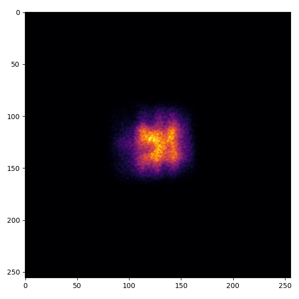

.. heliostat_raytracing:

``ARTIST`` Tutorial: Heliostat Raytracing
=========================================

.. note::
    You can find the corresponding ``Python`` script for this tutorial here:
    https://github.com/ARTIST-Association/ARTIST/blob/main/tutorials/01_heliostat_raytracing_tutorial.py

This tutorial provides a brief introduction to ``ARTIST`` showcasing how Heliostat Raytracing is performed. The tutorial
will run through some basic concepts necessary to understanding ``ARTIST`` including:

- How to load a scenario.
- Activating the kinematic in a heliostat to align this heliostat for raytracing.
- Performing heliostat raytracing to generate a flux density image on the receiver.

Loading a Scenario
------------------
Before we load the scenario you need to decide which scenario file to use. This tutorial is based on a simple scenario
which you can create in the previous tutorial on generating a scenario. However, since generating a scenario involves
training Non-Uniform Rational B-Splines (NURBS) and may take a while, we have also provided the scenario file online
for your convenience.

Therefore, the first step is to decide if you want to use your previously created scenario or the online version. If
you want to use the online version you must adjust the boolean ``DOWNLOAD_DATA`` to ``True``. If not you need to adjust
the path and name of the ``scenario_file`` variable:

.. code-block::

    USE_DOWNLOADED_DATA = False   # Select true if you want to use downloaded data.
    scenario_name = "please/insert/the/path/to/your/scenario/here/name.h5" # Adjust if you want to use your local scenario.

Once you have adjusted these parameters we can load a scenario in ``ARTIST`` by simply calling the
``load_scenario_from_hdf5()`` method, which is a python ``Classmethod`` that initializes a ``Scenario`` object based on
the configuration contained in the HDF5 file.

.. code-block::

    # Load the scenario.
    with h5py.File(scenario_name, "r") as f:
        example_scenario = Scenario.load_scenario_from_hdf5(scenario_file=f)

When loading the scenario, a large number of log messages are generated:

.. code-block::

    [2024-05-23 15:09:33,129][artist.scenario][INFO] - Loading an ``ARTIST`` scenario HDF5 file. This scenario file is version 1.0.
    [2024-05-23 15:09:33,130][artist.field.receiver_field][INFO] - Loading a receiver field from an HDF5 file.
    [2024-05-23 15:09:33,130][artist.field.receiver][INFO] - Loading receiver1 from an HDF5 file.
    [2024-05-23 15:09:33,132][artist.field.receiver][WARNING] - No curvature in the east direction set for the receiver!
    [2024-05-23 15:09:33,132][artist.field.receiver][WARNING] - No curvature in the up direction set for the receiver!
    [2024-05-23 15:09:33,132][artist.scene.light_source_array][INFO] - Loading a light source array from an HDF5 file.
    [2024-05-23 15:09:33,133][artist.scene.sun][INFO] - Loading sun1 from an HDF5 file.
    [2024-05-23 15:09:33,134][artist.scene.sun][INFO] - Initializing a sun modeled with a multivariate normal distribution.
    [2024-05-23 15:09:33,139][artist.scenario][WARNING] - No kinematic prototype initial_kinematic_orientation_offset_n set.Using default values!
    [2024-05-23 15:09:33,140][artist.scenario][WARNING] - No kinematic prototype initial_kinematic_orientation_offset_u set.Using default values!
    [2024-05-23 15:09:33,140][artist.scenario][WARNING] - No prototype kinematic first_joint_translation_e set. Using default values!
    [2024-05-23 15:09:33,140][artist.scenario][WARNING] - No prototype kinematic first_joint_translation_n set. Using default values!
    [2024-05-23 15:09:33,141][artist.scenario][WARNING] - No prototype kinematic first_joint_translation_u set. Using default values!
    [2024-05-23 15:09:33,141][artist.scenario][WARNING] - No prototype kinematic first_joint_tilt_e set. Using default values!
    [2024-05-23 15:09:33,141][artist.scenario][WARNING] - No prototype kinematic first_joint_tilt_n set. Using default values!
    [2024-05-23 15:09:33,141][artist.scenario][WARNING] - No prototype kinematic first_joint_tilt_u set. Using default values!
    [2024-05-23 15:09:33,142][artist.scenario][WARNING] - No prototype kinematic second_joint_translation_e set. Using default values!
    [2024-05-23 15:09:33,142][artist.scenario][WARNING] - No prototype kinematic second_joint_translation_n set. Using default values!
    [2024-05-23 15:09:33,142][artist.scenario][WARNING] - No prototype kinematic second_joint_translation_u set. Using default values!
    [2024-05-23 15:09:33,142][artist.scenario][WARNING] - No prototype kinematic second_joint_tilt_e set. Using default values!
    [2024-05-23 15:09:33,143][artist.scenario][WARNING] - No prototype kinematic second_joint_tilt_n set. Using default values!
    [2024-05-23 15:09:33,143][artist.scenario][WARNING] - No prototype kinematic second_joint_tilt_u set. Using default values!
    [2024-05-23 15:09:33,143][artist.scenario][WARNING] - No prototype kinematic concentrator_translation_e set. Using default values!
    [2024-05-23 15:09:33,143][artist.scenario][WARNING] - No prototype kinematic concentrator_translation_u set. Using default values!
    [2024-05-23 15:09:33,143][artist.scenario][WARNING] - No prototype kinematic concentrator_translation_n set. Using default values!
    [2024-05-23 15:09:33,144][artist.scenario][WARNING] - No prototype kinematic concentrator_tilt_e set. Using default values!
    [2024-05-23 15:09:33,144][artist.scenario][WARNING] - No prototype kinematic concentrator_tilt_n set. Using default values!
    [2024-05-23 15:09:33,144][artist.scenario][WARNING] - No prototype kinematic concentrator_tilt_u set. Using default values!
    [2024-05-23 15:09:33,145][artist.scenario][WARNING] - No prototype actuator_increment set for actuator1. Using default values!
    [2024-05-23 15:09:33,145][artist.scenario][WARNING] - No prototype initial_stroke_length set for actuator1. Using default values!
    [2024-05-23 15:09:33,145][artist.scenario][WARNING] - No prototype offset set for actuator1. Using default values!
    [2024-05-23 15:09:33,146][artist.scenario][WARNING] - No prototype radius set for actuator1. Using default values!
    [2024-05-23 15:09:33,146][artist.scenario][WARNING] - No prototype phi_0 set for actuator1. Using default values!
    [2024-05-23 15:09:33,147][artist.scenario][WARNING] - No prototype actuator_increment set for actuator2. Using default values!
    [2024-05-23 15:09:33,147][artist.scenario][WARNING] - No prototype initial_stroke_length set for actuator2. Using default values!
    [2024-05-23 15:09:33,147][artist.scenario][WARNING] - No prototype offset set for actuator2. Using default values!
    [2024-05-23 15:09:33,147][artist.scenario][WARNING] - No prototype radius set for actuator2. Using default values!
    [2024-05-23 15:09:33,148][artist.scenario][WARNING] - No prototype phi_0 set for actuator2. Using default values!
    [2024-05-23 15:09:33,148][artist.field.heliostat_field][INFO] - Loading a heliostat field from an HDF5 file.
    [2024-05-23 15:09:33,149][artist.field.heliostat][INFO] - Loading heliostat1 from an HDF5 file.
    [2024-05-23 15:09:33,149][artist.field.heliostat][INFO] - Individual surface parameters not provided - loading a heliostat with the surface prototype.
    [2024-05-23 15:09:33,150][artist.field.heliostat][INFO] - Individual kinematic configuration not provided - loading a heliostat with the kinematic prototype.
    [2024-05-23 15:09:33,150][artist.field.heliostat][INFO] - Individual actuator configurations not provided - loading a heliostat with the actuator prototype.

These log messages consist of three brackets:

   - The first bracket, e.g. ``[2024-05-22 18:10:21,397]`` displays the time stamp.
   - The second bracket, e.g. ``[artist.scenario]`` displays the file that generated the log message.
   - The third bracket, e.g. ``[INFO]`` or ``[WARNING]`` displays the level for which the log message is being generated.
   - Finally, after the three brackets, the log message is printed.

Whilst there are quite a few log messages, there are two important aspects we should note:

   1. The majority of the messages are warnings -- however, this is not a problem. We are considering a simplistic
      scenario, and as a result do not include specific kinematic or actuator parameters or deviations. Therefore,
      ``ARTIST`` automatically uses the default values. In this case, this is the desired behavior, and we can ignore the
      warnings!
   2. The remaining messages are info messages. These messages are informing us of the names of the objects being
      loaded from the HDF5 file, important information about these objects, and at the very end stating that the
      heliostat does not contain individual parameters and is (as we expect) being loaded using the prototypes.

Before we start using this scenario we can inspect it, for example by printing the scenario properties or investigating
what type of light source and receiver is included.

.. code-block::

    print(example_scenario)
    print(f"The light source is a {example_scenario.light_sources.light_source_list[0]}")
    print(
        f"The receiver type is {example_scenario.receivers.receiver_list[0].receiver_type}"
    )
    single_heliostat = example_scenario.heliostats.heliostat_list[0]
    print(f"The heliostat position is: {single_heliostat.position}")
    print(f"The heliostat is aiming at: {single_heliostat.aim_point}")

This code generates the following output:

.. code-block::

    ``ARTIST`` Scenario containing:
        Receivers: 1, 	Light Sources: 1,	 Heliostats: 1
    The light source is a Sun()
    The receiver type is planar
    The heliostat position is: tensor([0., 5., 0., 1.])
    The heliostat is aiming at: tensor([  0., -50.,   0.,   1.])

Aligning a Heliostat
--------------------
Before we can start raytracing we need to align the heliostat. In the current scenario our heliostat has been
initialized pointing straight up at the sky. Unfortunately, this orientation is not very useful for reflecting
sunlight from the sun onto the receiver that is located in the south (see aim point above).

Therefore, we make use of our knowledge regarding the:

- Position of the heliostat,
- Aim point that,
- Kinematic model,

to align the heliostat in a optimal position for reflection. To perform this orientation we need a *incident ray
direction*, i.e. a direction vector pointing towards the sun with the origin at the heliostat. Given an *incident ray
direction* we can align the heliostat with the following code.

.. code-block::

    # Align the heliostat
    single_heliostat.set_aligned_surface(
        incident_ray_direction=incident_ray_direction_south
    )

We can compare the original surface and the aligned surface in the following plot:

Since both the receiver and the sun are directly to the south of the heliostat, this alignment is completely plausible.
The heliostat is rotated 90 degrees along the North axis to reflect the sunlight back in the direction it is coming
from.

Raytracing
----------
With the heliostat now aligned, it is time to perform some raytracing to generate flux density images.

In this tutorial, we are considering *heliostat raytracing*. Heliostat raytracing (as it's name suggests) traces rays
of sunlight from the heliostat. If we were to trace rays from the sun, then only a small portion would hit the heliostat
and even a smaller portion of these rays would hit the receiver. Therefore, heliostat raytracing can be computationally
efficient. Concretely, the heliostat raytracing involves three main steps:

1. We calculate the preferred reflection direction. This preferred reflection direction models the direction of a ray
   coming directly from the sun to the heliostat, i.e. along the incident ray direction. Specifically, we reflect this
   ray at every point on the heliostat to generate multiple *ideal* reflections.
2. This single ray only models an *ideal* direction, but we need to account for all possible rays coming from the sun.
   Therefore, we use our model of the sun to create *distortions* which we then use to slightly alter the preferred
   reflection directions multiple times, thus generating many realistically reflected rays.
3. We trace these rays onto the heliostat by performing a *line-plane-intersection* and determining the resulting flux
   density image on the receiver.

Luckily, ``ARTIST`` automatically performs all of these steps within the ``HeliostatRayTracer`` class! Therefore, raytracing
with ``ARTIST`` involves two simple lines of code. First, we define the ``HeliostatRayTracer``. A ``HeliostatRayTracer``
only requires a ``Scenario`` object as an argument, but in this tutorial we additionally define the ``batch_size``.
The ``batch_size`` defines the number of rays that are traced at one.

.. code-block::

    # Define the raytracer.
    raytracer = HeliostatRayTracer(scenario=example_scenario, batch_size=100)

Internally, a ``HeliostatRayTracer`` uses a ``torch.Dataset`` to generate rays and the distortion of the preferred
reflection direction, line plane intersection, and calculation of the resulting flux density image can be performed
in parallel if desired. However, for this tutorial we will stick to a simple sequential process.

With everything now set up, we can generate a flux density image by calling the ``trace_rays()`` function with the
desired incident ray direction and finally normalizing the resulting image.

.. code-block::

    # Perform heliostat-based raytracing.
    image_south = raytracer.trace_rays(incident_ray_direction=incident_ray_direction_south)
    image_south = raytracer.normalize_bitmap(image_south)

If we plot the output we get the following flux density image!

That's it - a simple example of heliostat raytracing with ``ARTIST``!

Of course, this one scenario is capable of performing raytracing for any incident ray direction. For example, we can consider
three further incident ray directions and perform raytracing using a helper function that combines alignment and
raytracing with the following code:

.. code-block::

    # Define light directions.
    incident_ray_direction_east = torch.tensor([1.0, 0.0, 0.0, 0.0])
    incident_ray_direction_west = torch.tensor([-1.0, 0.0, 0.0, 0.0])
    incident_ray_direction_above = torch.tensor([0.0, 0.0, 1.0, 0.0])

    # Perform alignment and raytracing to generate flux density images.
    image_east = align_and_trace_rays(light_direction=incident_ray_direction_east)
    image_west = align_and_trace_rays(light_direction=incident_ray_direction_west)
    image_above = align_and_trace_rays(light_direction=incident_ray_direction_above)

If we were to now plot the results of all four considered incident ray directions we get the following image:

.. figure:: ./images/tutorial_multiple_flux.png
   :width: 100 %
   :align: center
