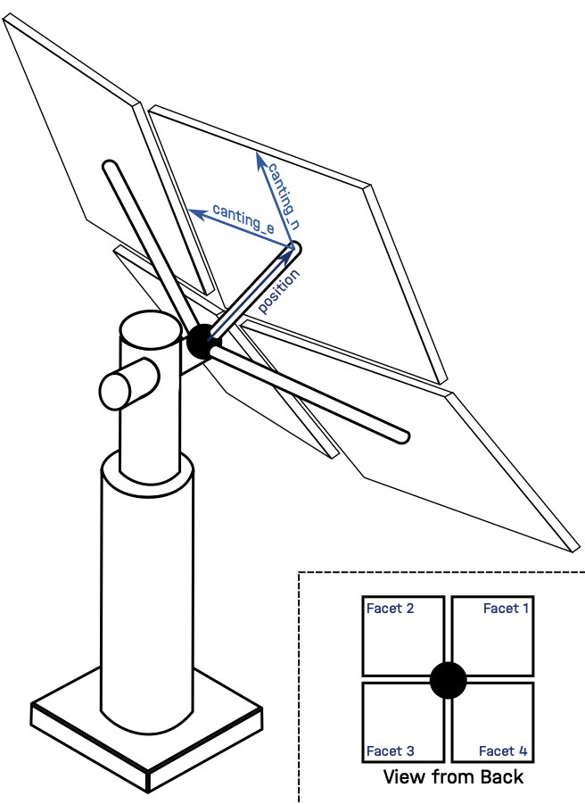
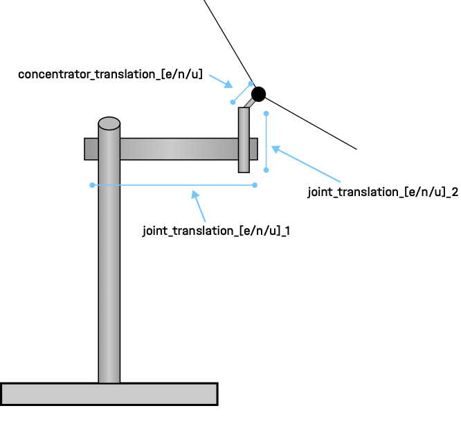
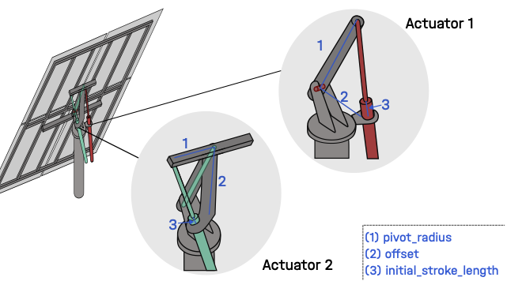

.. _heliostats:

Understanding Heliostats
========================

``ARTIST`` is a digital twin for concentrating solar tower power plants. One of the most important components of these
plants are the *heliostats*, i.e., mirrors that reflect sunlight onto the receiver. Heliostats are not ideal flat
mirrors; they are complex mechanical systems that must be modeled accurately. In ``ARTIST``, heliostats are represented
using three key components: a *surface*, a *kinematics model*, and *actuators*. This page provides a brief overview of
how heliostats are modeled in ``ARTIST`` and describes the specific models currently supported.

Surfaces
^^^^^^^^
The surface is the crucial optical component of a heliostat, as it reflects sunlight onto the receiver. This makes
accurately modeling the surface essential. In ``ARTIST``, a heliostat surface is represented by multiple facets, which
can be canted at an angle to improve sunlight concentration.

Most commonly, heliostats in ``ARTIST`` have four facets, as illustrated in the figure below:

As you can see, each facet has a ``position`` relative to a reference point at the heliostat's center and canting
direction vectors (``canting_e``, ``canting_n``) that define its orientation.

Kinematics
^^^^^^^^^^
The heliostat's *kinematics* model describes the motion of its mechanical system and determines the final orientation
of the heliostat surface for given input parameters, e.g., actuator positions. Actuators are the motor-driven joints
that convert control inputs into mechanical motion, allowing the heliostat surface to be oriented toward the receiver.
Once the orientation has been computed, the kinematics model calculates the aligned surface points and normals used in
the ray tracing. The choice of kinematics model depends on the heliostat design, including the number and type of
actuators and the available information about the mechanical system.

The abstract class ``Kinematics`` provides a method for aligning the heliostat surface. This method first computes the
desired heliostat orientation from the input parameters and then applies the corresponding transformation to the surface
geometry. All kinematics implementations derive from this class and override this method.

``ARTIST`` currently supports *rigid-body kinematics* through the ``RigidBody`` class. This model represents a heliostat
with two actuators, allowing motion in two directions. The actuators introduce mechanical offsets that are modeled as
translation vectors for three components: joint one, joint two, and the concentrator. The concentrator denotes the
mirror assembly of the heliostat, i.e., the reflective surface and its supporting structure mounted after joint two and
oriented by the actuators. Translation vectors are defined in east, north, and up directions as illustrated below:

In ``ARTIST``, these translations and the possible rotations of each joint are represented by the tensors
``translation_deviation_parameters`` and ``rotation_deviation_parameters``, respectively (see
:py:class:`artist.field.kinematics_rigid_body.RigidBody`). This allows multiple heliostats with slightly different
mechanical properties to be modeled efficiently.
Joint one, joint two, and the concentrator all have translations in the east, north, and up directions, resulting in a
nine-dimensional ``translation_deviation_parameters`` tensor. The `rotation_deviation_parameters` describe rotational
deviations of the actuator joints: joint one has deviations in the north and up directions, and joint two in the east
and north direction. This results in a four-dimensional rotation parameter tensor for the rigid-body kinematics model.

Actuators
^^^^^^^^^
Heliostat actuators are the motors responsible for adjusting the heliostat surface orientation so that sunlight is
directed toward a specified aim point. Actuators are described by a set of actuator parameters, which may include
information about motor turning direction, step size, and geometric offsets. During initialization, actuator parameters
are separated into ``non_optimizable_parameters`` and ``optimizable_parameters``. The abstract class ``Actuators``
defines two core methods: one for mapping motor steps to angles and another for mapping angles to motor steps. All
actuator implementations derive from this class and override these methods.

``ARTIST`` currently supports two actuator types:

- ``LinearActuators``
- ``IdealActuators``

The ``LinearActuators`` model is based on the actuator used in the Jülich power plant and includes the parameters
illustrated in the figure below:

.. list-table:: Linear Actuator Non-Optimizable Parameters
   :header-rows: 1
   :widths: 20 80

   * - Parameter Name
     - Description
   * - ``type``
     - The type of actuator
   * - ``clockwise_axis_movement``
     - A boolean indicating if the movement direction is clockwise
   * - ``min_motor_pos``
     - Minimum allowed motor position
   * - ``max_motor_pos``
     - Maximum allowed motor position
   * - ``increment``
     - Number of motor increments per full stroke
   * - ``offset``
     - Physical offset from the actuator axis to the pivot, (2) in the figure above
   * - ``pivot_radius``
     - Distance from the pivot center to the actuator anchor, (1) in the figure above

.. list-table:: Linear Actuator Optimizable Parameters
   :header-rows: 1
   :widths: 20 80

   * - Parameter Name
     - Description
   * - ``initial_angle``
     - Initial angular position of the actuator
   * - ``initial_stroke_length``
     - Initial extension length of the actuator, (3) in the image above

In ``ARTIST``, the linear actuator model is physics-informed to prevent invalid values and numerical instabilities
during forward and backward passes. The parameters ``increment``, ``initial_stroke_length``, ``offset``, and
``pivot_radius`` are constrained to be strictly positive using the ``softplus`` function, ensuring physically meaningful
values throughout the optimizations.

Additionally, both methods use the law of cosines to convert between motor steps and actuator steps. The stroke length,
offset, and pivot radius form a triangle that determines the actuator's distance from the rotational center of the
joint. For the law of cosines to be applicable, the triangle's sides (offset and pivot radius) must satisfy the triangle
inequality:

.. math::

    |offset - pivot\_radius| \leq stroke\_length \leq offset + pivot\_radius

This constraint ensures that a valid triangle can always be formed. The resulting physics-informed formulation allows
the linear actuator to model real actuator behavior accurately and efficiently.

The ``IdealActuators`` model has no optimizable parameters. The non-optimizable parameters only include ``type``,
``clockwise_axis_movement``, ``min_motor_pos``, and ``max_motor_pos``.
