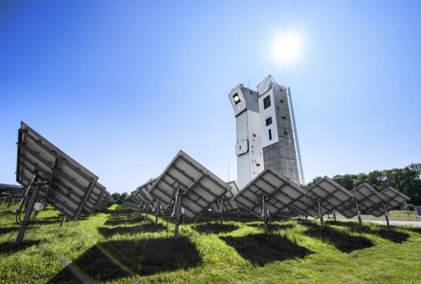

.. artist documentation master file, created by
   sphinx-quickstart on Tue Feb 27 14:09:36 2024.
   You can adapt this file completely to your liking, but it should at least
   contain the root `toctree` directive.

Welcome to ``ARTIST``
=====================
``ARTIST`` stands for **AI-enhanced differentiable Ray Tracer for Irradiation Prediction in Solar
Tower Digital Twins**.
The ``ARTIST`` package provides an implementation of a fully differentiable ray tracer using the `PyTorch`_
machine-learning framework in ``Python``. Leveraging automatic differentiation and GPU computation, it facilitates the
optimization of heliostats, towers, and camera parameters within a solar field by combining gradient-based optimization
methods with smooth parametric descriptions of heliostats.

   *The concentrating solar power plant in Jülich, Germany.*

|:sunny:| Our key contributions include:

* **Immediate deployment:** ``ARTIST`` enables deployment at the beginning of a solar thermal plant's operation,
  allowing for in-situ calibration and subsequent improvements in energy efficiencies and cost reductions.

* **Neural-network driven heliostat calibration:** A two-layer hybrid model for most efficient heliostat calibration.
  It comprises a robust geometric model for pre-alignment and a neural network disturbance model, which gradually adapts
  its impact via regularization sweeps. In this way, high data requirements of data-centric methods are overcome while
  maintaining flexibility for modeling complex real-world systems. Check out this paper for more details |:point_down:|:

  *M. Pargmann, M. Leibauer, V. Nettelroth, D. M. Quinto, & R. Pitz-Paal (2023). Enhancing heliostat calibration
  on low data by fusing robotic rigid body kinematics with neural networks. Solar Energy, 264, 111962.*
  `https://doi.org/10.1016/j.solener.2023.111962`_

* **Surface reconstruction and flux density prediction:** Leveraging learning Non-Uniform Rational B-Splines (NURBS),
  ``ARTIST`` reconstructs heliostat surfaces accurately using calibration images commonly available in solar thermal
  power plants. Thus, we can achieve sub-millimeter accuracy in mirror reconstruction from focal spot images,
  contributing to improved operational safety and efficiency. The reconstructed surfaces can be used for predicting
  unique heliostat flux densities with state-of-the-art accuracy. Check out this paper for more details |:point_down:|:

  *M. Pargmann, J. Ebert, D. M. Quinto, R. Pitz-Paal, & S. Kesselheim (2023). In-Situ Solar Tower Power Plant
  Optimization by Differentiable Raytracing. Under review at Nature Communications.*
  `https://doi.org/10.21203/rs.3.rs-2554998/v1`_

* **Optimized flux density:** Coming soon, so stay tuned |:rocket:|!

Quick Install
=============
To install ``ARTIST``, run the following in your terminal:

.. code-block:: console

    $ pip install https://github.com/ARTIST-Association/ARTIST

You can check whether your installation was successful by importing ``ARTIST`` in ``Python``:

.. code-block:: python

   import artist

You can find more detailed installation instructions in :ref:`installation`.

* To find out more about to how to use artist check out :ref:`usage`.

.. toctree::
   :maxdepth: 1
   :caption: Contents

   install
   usage

.. Links
.. _PyTorch: https://pytorch.org/
.. _https://doi.org/10.1016/j.solener.2023.111962: https://doi.org/10.1016/j.solener.2023.111962
.. _https://doi.org/10.21203/rs.3.rs-2554998/v1: https://doi.org/10.21203/rs.3.rs-2554998/v1
.. _https://doi.org/10.21203/rs.3.rs-2898838/v1: https://doi.org/10.21203/rs.3.rs-2898838/v1

Indices and tables
==================

* :ref:`genindex`
* :ref:`modindex`
* :ref:`search`
