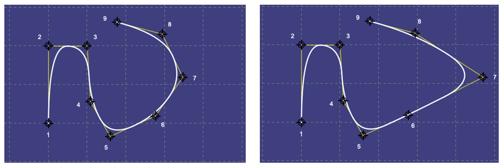
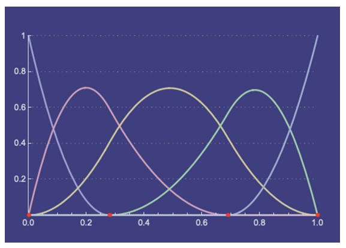
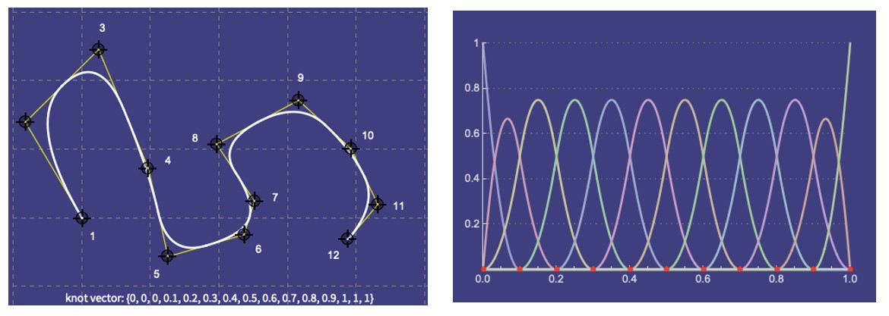
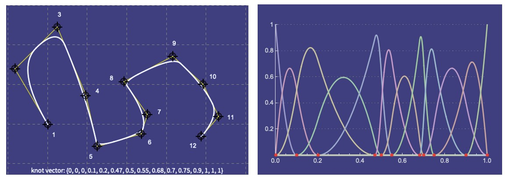

.. _nurbs:

An Introduction to NURBS
========================

``ARTIST`` uses Non-Uniform Rational B-Splines (NURBS) to model the surface of Heliostats for multiple reasons:

- NURBS can represent the continuous, complex and imperfect heliostat surfaces.
- NURBS can be differentiable, this enables their parameters to be learned and optimized using AI algorithms.
- NURBS representing heliostat surfaces can be constructed with less parameters than constructing heliostat surfaces
  from point clouds or deflectometry data.
- NURBS are **precise and performant**

This tutorial is divided into two parts. First we consider some **NURBS Theory** before investigating **NURBS in
ARTIST**.

NURBS Theory
------------

In this section of the tutorial we consider the NURBS theory.

Simplifications for the scope of this tutorial
^^^^^^^^^^^^^^^^^^^^^^^^^^^^^^^^^^^^^^^^^^^^^^

For the scope of this tutorial and for reasons of simplicity we only considers NURBS curves not surfaces.

- The behaviour of NURBS curves in 2 dimensions can easily be transferred to NURBS surfaces in 3 dimensions.
- Two NURBS curves can span a NURBS surface.

NURBS are generally parametrized by functions of the form :math:`Q(t)=\{X(t), Y(t)\}`, where :math:`t` can be
considered as a variable representing time. For a curve specifically, we can imagine this curve is traced out by a
particle moving through space. In this case, :math:`Q(t)` gives the :math:`\{x, y\}` coordinates of the particle at
time :math:`t`.

Key components and characteristics of NURBS
^^^^^^^^^^^^^^^^^^^^^^^^^^^^^^^^^^^^^^^^^^^

NURBS are made up out of the following components:

- Control points,
- Basis functions,
- Knots,
- Weights and
- Degrees.

Different manifestations of these components result in different properties of the NURBS, for example non-uniformity or
rationality.

To better understand this we will consider each of these components and characteristics in more detail.

Degree
""""""

The degree is always a positive integer and closely related to the order, specifically:

.. math::

 \text{degree} = \text{order} - 1

For example, a third-order curve is represented by quadratic polynomial which result sin a quadratic curve. Note that:

- It is possible to increase the degree of the NURBS curve without changing its form.
- It is not possible to reduce the degree without changing its form.

Control points
""""""""""""""

The shape of the NURBS is directly determined by the control points. The most important aspects to remember about
control points are:

- The higher the number of control points the better the approximation of a given curve.
- The control points are represented in as a list of points, importantly the **length of this list must be at least**
  :math:`\text{degree}+1`.
- The shape formed by connected each of the control points with a straight line is the *control polygon*.

In the figure below we see how the control points influence the shape of the NURBS curve.

More specifically:

- The only parameter that changes between the two curves is the location of control point :math:`7`.
- The change in the curve is limited to the local neighborhood of that control point.

This example demonstrates one key aspect of nurbs: each control point only influences the part of the curve nearest to
it and has little or no effect on parts of the curve that are farther away. Considering the example of a particle moving
through time from before, we can say that at any time :math:`t` the particle´s position is a weighted average of all
control points but the points closer to the particle are weighted more than those farther away.

We can express this idea mathematically via

.. math::

    Q(t) = \sum_{t=0}^{n-1} B_i N_{i,k}(t)

where :math:`k = \text{order}` with :math:`\text{order} = \text{degree} + 1`, :math:`n = \text{number of control points}`,
:math:`B` are the control points, and :math:`N` represents the basis functions.

Basis functions
"""""""""""""""

Basis functions are assigned to control points with each control point having a corresponding basis function.
Importantly :math:`N_{i,k}(t)` are the basis functions and they determine how strongly the control point :math:`B_i`
influences the NURBS curve at time :math:`t`.

To better understand basis functions, let us consider the following image:

Here we see exemplary basis functions for a NURBS curve with 5 control points. Each control point has one basis
function. The red basis function is assigned to control point 2, considering the interval :math:`t = 0` to
:math:`t = 0.7`. This is the time interval during which control point 2 controls the shape of the NURBS curve. For
:math:`t = 0.8` only the basis functions of control point 3, 4 and 5 are activated thus only control points 3, 4 and 5
control the shape of the NURBS curve at that time. Since the green basis function that is assigned to control point 4
peaks at :math:`t = 0.8`, this control point has the most influence on the NURBS curve at that point in time. Some
further important observations include:

- At any time :math:`t`, the values of all basis functions add up to exactly 1.
- At any time :math:`t`, no more than :math:`k` basis functions affect the curve
  (:math:`k = \text{order} = \text{degree} + 1`). The example above is of order 3
- A curve of order :math:`k` is only defined for periods where :math:`k` of the basis functions are non zero.
- In the example above all control points affect same-sized regions of the curve and also affect the curve with the same
  strength, thus they are uniform (and have uniform knot vectors).
- If this is not desired then non-uniform NURBS non-uniform knots must be considered.

In ``ARTIST`` we only apply uniform NURBS are considered, however to complete the tutorial we should also understand
how to create non-uniform NURBS.

Knots
"""""

Knots are a series of points that partition the overall time it takes the particle to move along the curve into
intervals. Knots are represented as an ordered list of numbers where

.. math::
    \text{knot list length} = \text{degree} + \text{number of control points} + 1

By varying the relative lengths of the intervals, the amount of time each control point affects the particle is varied
- also known as the knot spans.

To understand this in more detail lets look at some examples. First, a *uniform knot vector* implies that all knots are
equidistant and as a result all basis functions cover equal intervals of time, as shown below:

On the other hand a *non-uniform knot vector* contains knot spans of different sizes which means that the basis
functions cover different intervals of time, as shown below:

It is important to note that not all basis functions are the same. Some are taller and some are wider than others. This
is because the knot spans vary. For smaller knot spans the basis functions become taller and narrower. For the
corresponding control points, the curve is pulled more strongly to those control points.

Using our knowledge on knots, we can now formulate the following mathematical definition of the basis functions:

.. math::

    N_{i,1}(t) = \begin{cases} 1 & \text{if } x_i \leq t < x_{i+1} \\ 0 & \text{otherwise}\end{cases} \\
    N_{i,k}(t) = \frac{(t-x_i)N_{i,k-1}(t)}{x_{i+k-1}-x_i} + \frac{(x_{i+k}-t)N_{i+1,k-1}(t)}{x_{i+k}-x_{i+1}}

where :math:`x_i` is the i-th knot in the knot vector.

Knot span
"""""""""

We already discussed the knot span, however there are a few important terms we need to define:

- If we have a knot span of zero length, i.e. two consecutive knots have the same value then this is a
  *knot with multiplicity*. Importantly, a knot as *full multiplicity* if :math:`\text{multiplicity} = \text{degree}`.
  Furthermore, a *simple knot* is a knot with a multiplicity of 1.
- If the first and last knot have full multiplicity, the NURBS curve begins and ends in a control point. Full
  multiplicity in the first and last knot does not affect the uniformity property.
- *Uniformity* describes knot vectors that start and end with full multiplicity knots, and contain simple knots with
  knot spans of the same length inbetween. For example the knot vector :math:`[0,0,0,1,2,3,4,4,4]` describes
  *uniformity* for a degree of 3.

Control weights
"""""""""""""""

The last aspect of NURBS we want to consider are the control weights. The control weight are responsible for the
*rational* property of NURBS:

- If all control weights are always 1 the NURBS are non-rational which is a special subset of rational NURBS.
- If all control weights have a weight of 1, this implies that each control point has an equal influence on the shape of
  the curve
- Increasing the weight of one control point gives it more influence and "pulls" the curve towards that control point.
- Rational curves imply that some or all control weights differ from 1.

Note that in ``ARTIST`` all control weights are always 1.

NURBS in ``ARTIST``
-------------------

Now we know the basics of NURBS, lets look briefly at how ``ARTIST`` makes use of NURBS. Importantly:

- The NURBS in ``ARTIST`` are differentiable.
- They are primarily used to model the heliostat surfaces, however they can also be used to model other surfaces, such
  as the receiver.
- The NURBS in ``ARTIST`` are uniform and non-rational, the name NURBS can therefore be misleading, however the uniform
  and non-rational implementation is a subset of NURBS.

Code
^^^^

The NURBS code in ``ARTIST`` is contained in `nurbs.py` which can be found under `artist/util`. The `nurbs.py`
implements the ``NURBSSurface`` class and inherits from ``torch.nn.Module`` allowing for gradient based calculations.

Usage
^^^^^

Using NURBS in ``ARTIST`` is simple:

- A NURBS surface can be initialized by only providing the desired ``degree_e`` and ``degree_n``, the
  ``evaluation_points_e`` and ``evaluation_points_n``, and the ``control points``, where ``e`` and ``n`` stand for the
  east and north directions. For a NURBS surface two degrees are necessary as two NURBS curves span the surface.
  Internally the uniform knot vectors ``knots_e`` and ``knots_n`` are calculated from the input.
- The user can then simply call ``calculate_surface_points_and_normals()`` on the ``NURBSSurface`` and the surface
  points and surface normals are calculated and returned.

For this calculation of the surface points and surface normals three internal steps are executed:

1. ``find_span()`` is called for both directions (east and north), to determine which evaluation point corresponds to
   which knot in the knot vector.
2. Next the basis functions and their derivatives are calculated, again for both directions using
   ``basis_function_and_derivatives()``
3. Lastly the surface points and normals are calculated from the basis functions, their derivatives and the control
   points.
