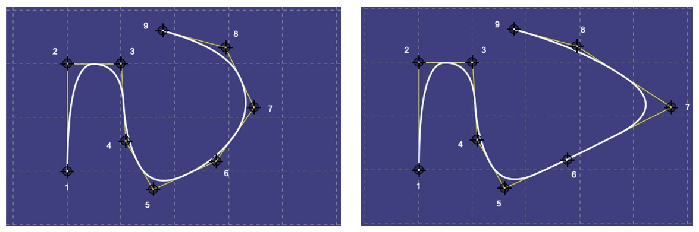
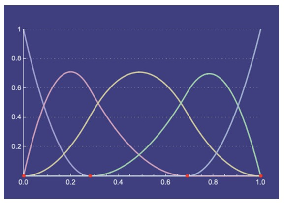
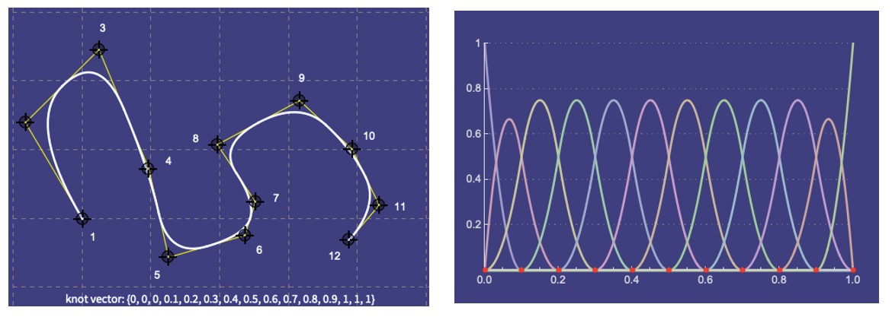
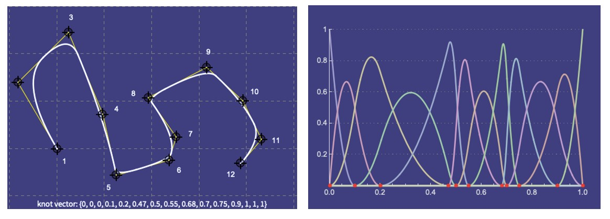

.. _nurbs:

NURBS in ``ARTIST``
===================

``ARTIST`` uses *Non-Uniform Rational B-Splines (NURBS)* to model heliostat surfaces. NURBS provide a flexible and
mathematically well-founded representation that is particularly suited for optical surface modeling.
Using NURBS in ``ARTIST`` is motivated by several key properties:

- **Expressiveness:** NURBS can represent continuous, smooth, and geometrically complex heliostat surfaces, including
  manufacturing imperfections and deformations.
- **Differentiability:** NURBS formulations are differentiable with respect to their control parameters. This enables
  gradient-based learning and optimization of surface parameters within the differentiable ray-tracing framework.
- **Parameter efficiency:** Compared to point-cloud or deflectometry-based surface representations, NURBS achieve
  comparable accuracy with significantly fewer parameters.
- **Precision and performance:** NURBS offer numerically stable surface evaluation and efficient computation, making them
  suitable for large-scale optimization tasks.

We first introduce the relevant NURBS theory before we describe how NURBS are implemented and used in ``ARTIST``.
All figures on this page were generated with the tool provided by Yu-Sung Chang (2007), "B-Spline Curve with Knots"
`Wolfram Demonstrations Project`_.

NURBS Theory
------------

This section provides a theoretical overview of NURBS as the mathematical foundation for modeling heliostat surfaces
in ``ARTIST``. For simplicity, we focus on *two-dimensional NURBS curves* rather than three-dimensional NURBS surfaces.
The behavior of 2D NURBS curves can be directly extended to 3D NURBS surfaces, as a NURBS surface can be constructed
from two NURBS curves spanning a parametric domain.

A NURBS curve is parametrized as :math:`Q(t)=\{X(t), Y(t)\}`, where :math:`t` can be interpreted as a "time" variable.
Conceptually, imagine a particle moving through space along the curve :math:`Q(t)`, which then represents the
particle's position :math:`\{x, y\}` at time :math:`t`.

Key Components and Characteristics of NURBS
^^^^^^^^^^^^^^^^^^^^^^^^^^^^^^^^^^^^^^^^^^^

NURBS are defined by five main components:

- Control points
- Basis functions
- Knots
- Weights
- Degrees

Different manifestations of these components result in different properties of the NURBS, such as non-uniformity or
rationality.

To better understand this, we will consider each of these components and their characteristics in more detail below.

Degree
""""""

The degree is a positive integer and closely related to the polynomial order of the NURBS curve, specifically:

.. math::

 \text{degree} = \text{order} - 1

For example, a third-order curve is represented by a quadratic polynomial which results in a quadratic curve. Note that:

- You can increase the degree of a NURBS curve without altering its form.
- You cannot reduce the degree without altering its form.

Control Points
""""""""""""""

The shape of a NURBS curve is governed by its control points. The most important aspects to remember about
control points are:

- More control points allow finer approximation of a target curve.
- The list of control points must have at least :math:`\text{degree}+1=\text{order}` points.
- The *control polygon* is the shape formed by connecting the control points with straight lines.

The figure below shows how the control points influence the shape of the NURBS curve. The only parameter that changes
between the left and right curve is the location of control point 7, and the resulting change in the curve is limited to the local
neighborhood of that control point.

This example demonstrates a key aspect of NURBS: Each control point only influences the curve in its local neighborhood
and has little or no effect farther away. Interpreting the curve as the trajectory of a particle, its position at any
time :math:`t` can be understood as a weighted average of all control points, where nearby control points contribute
more strongly than those farther away. Mathematically, the curve can be expressed a weighted sum of the control points:

.. math::

    Q(t) = \sum_{i=1}^{n} B_i N_{i,k}(t)

where :math:`k = \text{degree} + 1` is the order of the curve, :math:`n` is the number of control points,
:math:`B_i` are the control points, and :math:`N_{i,k}(t)` are the basis functions.

Basis Functions
"""""""""""""""

Each control point has a corresponding basis function, :math:`N_{i,k}(t)`, determining how strongly a control point
:math:`B_i` influences the NURBS curve at time :math:`t`. To better understand basis functions, we consider the
following figure:

In the figure, we see five distinct basis functions. Three have peaks in the middle of the parameter domain, while two
are located near the boundaries. These functions correspond to a NURBS curve with five control points, as each control
point is associated with exactly one basis function. The red dots along the horizontal axis indicate the so-called
knots, which partition the parameter domain into intervals over which the basis functions are defined. Their precise
meaning and mathematical definition will be discussed in the following section.

In this example, the pink basis function (second from the left) is assigned to control point 2. It is non-zero over the
interval from :math:`t = 0` to :math:`t = 0.7`. This is the time interval in which control point 2 influences the curve
shape. At :math:`t = 0.8`, only the basis functions of control point 3, 4, and 5 are non-zero. Consequently, only these
three control points influence the curve at that time. Since the green basis function (assigned to control point 4,
second from the right) peaks at :math:`t = 0.8`, control point 4 has the strongest influence on the curve at that point
in time.

Important general observations include:

- At any time :math:`t`, the values of all basis functions sum up to 1.
- An order-:math:`k` curve (:math:`k = \text{degree} + 1`) is defined only over intervals where exactly :math:`k` basis
  functions are non-zero, so that only :math:`k` control points influence the curve at any time :math:`t`. The curve in
  the figure above is of order 3.
- In the example above, all control points affect equally sized regions of the curve and do so with the same strength.
  Thus, they are uniform (and have uniform knot vectors).
- If this is not desired, non-uniform NURBS with non-uniform knots must be considered.

``ARTIST`` currently uses uniform NURBS. Nevertheless, for completeness and a deeper understanding of the
underlying theory, it is important to also understand how non-uniform NURBS work.

Knots
"""""

Knots are a sequence of parameter values that partition the overall parameter domain — interpreted earlier as the “time”
it takes the particle to move along the curve — into smaller intervals. They are represented as an ordered list of
numbers satisfying

.. math::
    \text{knot list length} = \text{degree} + \text{number of control points} + 1.

The relative lengths of the intervals between consecutive knots determine how long a given control point influences the
curve. These intervals are called *knot spans*.

To understand this in more detail, let's look at some examples: A *uniform knot vector* consists of equally spaced
knots. All knot spans have the same length and the corresponding basis functions cover equal intervals of the parameter
domain. This is illustrated below:

In contrast, a *non-uniform knot vector* contains knot spans of different lengths. As a result, the associated basis
functions cover parameter intervals of different size:

An important observation is that not all basis functions need to have the same shape. When knot spans differ in size,
some basis functions become narrower and taller, while others become wider and flatter. Smaller knot spans lead to
narrower and higher basis functions, which increases the local influence of the corresponding control points. This means
the curve is pulled more strongly to those control points. In this way, the knot distribution directly controls how
strongly and over which parameter range each control point affects the curve.

Using this understanding, we can now formulate the following mathematical definition of the basis functions:

.. math::

    N_{i,1}(t) = \begin{cases} 1 & \text{if } x_i \leq t < x_{i+1} \\ 0 & \text{otherwise}\end{cases} \\\\
    N_{i,k}(t) = \frac{(t-x_i)N_{i,k-1}(t)}{x_{i+k-1}-x_i} + \frac{(x_{i+k}-t)N_{i+1,k-1}(t)}{x_{i+k}-x_{i+1}}\text{ for }k>1,

where :math:`x_i` is the :math:`i`-th knot in the knot vector.

Knot Span
"""""""""

We have already introduced the concept of knot spans. However, several related terms require a more precise definition:

- A knot span of length zero occurs when two consecutive knots have the same value. In this case, the knot has a certain
  *multiplicity*, defined as the number of times that knot value appears in the knot vector.
- A knot has *full multiplicity* if :math:`\text{multiplicity} = \text{degree}`.
- A *simple* knot is a knot with a multiplicity of 1.

If the first and last knot have full multiplicity, the NURBS curve begins and ends exactly at the first and last control
point, respectively. Importantly, full multiplicity at the boundaries does not contradict the uniformity property.
The term uniformity refers to knot vectors that
- start and end with full multiplicity knots, and
- contain only simple knots inbetween,
- with all interior knot spans having equal length.

For example, the knot vector :math:`{0,0,0,1,2,3,4,4,4}` describes *uniformity* for a curve of degree 3.

Control Weights
"""""""""""""""

The last aspect of NURBS we want to consider are the control weights. The control weights are responsible for the
*rational* property of NURBS:

- If all control weights are 1, the curve is non-rational. Non-rational NURBS are a special case of rational NURBS.
- If all control weights are equal, this implies that each control point has an equal influence on the shape of
  the curve.
- Increasing the weight of a specific control point increases its influence and effectively "pulls" the curve towards
  that control point.
- A curve is called rational if at least one control weight differs from 1.

In ``ARTIST``, all control weights are set to 1. Therefore, only non-rational NURBS are currently used.

The Parametric UV Space of 3D NURBS Surfaces
--------------------------------------------

Unlike other parts of ``ARTIST``, NURBS surfaces use the parameters :math:`u` and :math:`v` instead of the Cartesian
coordinates east, north, and up. This reflects the mathematical formulation of NURBS.

NURBS are always defined in a parametric space, commonly called the UV space, where the parameters :math:`u` and
:math:`v` typically range from 0 to 1. Within this domain, the surface is described entirely through control points,
basis functions, knot vectors, and (optionally) weights. The physical surface in 3D Cartesian space does not exist until
it is sampled and evaluated. During the sampling, the east, north, up (or :math:`x`, :math:`y`, :math:`z`)
coordinates are first mapped into the UV domain so that the parametric basis functions can be evaluated, producing the
actual cartesian surface coordinates. The UV formulation enables NURBS to represent smooth, continuous surfaces in a
flexible and mathematically consistent way, which makes them particularly well suited for describing heliostat
geometries in ``ARTIST``.

NURBS in ``ARTIST``
-------------------

Now that we know the basics of NURBS, let us look briefly at how ``ARTIST`` makes use of NURBS. Importantly:

- The NURBS in ``ARTIST`` are differentiable.
- They are primarily used to model the heliostat surfaces, however they can also be used to model other surfaces, such
  as the receiver.
- The NURBS in ``ARTIST`` are uniform and non-rational. The name NURBS can therefore be misleading; however, the uniform
  and non-rational implementation is a subset of NURBS.

Code
^^^^

The NURBS code in ``ARTIST`` is contained in `nurbs.py` which can be found under `artist/util`. The `nurbs.py` module
implements the ``NURBSSurface`` class and inherits from ``torch.nn.Module``, allowing for gradient-based calculations.

Usage
^^^^^

Using NURBS in ``ARTIST`` is simple:

- A NURBS surface can be initialized by only providing the desired ``degrees`` in the ``u`` and ``v`` direction, and the
  associated ``control points``. For a NURBS surface, two degrees are necessary as two NURBS curves span the surface.
  Internally, the uniform knot vectors are calculated from the input.
- The user can then simply call ``calculate_surface_points_and_normals()`` on the ``NURBSSurface`` and the surface
  points and surface normals are calculated and returned.

For this calculation of the surface points and surface normals, three internal steps are executed:

1. ``find_span()`` is called for both directions to determine which evaluation point corresponds to
   which knot in the knot vector.
2. Next, the basis functions and their derivatives are calculated, again for both directions using
   ``basis_function_and_derivatives()``.
3. Lastly, the surface points and normals are calculated from the basis functions, their derivatives, and the control
   points.

.. _Wolfram Demonstrations Project: demonstrations.wolfram.com/BSplineCurveWithKnots/
