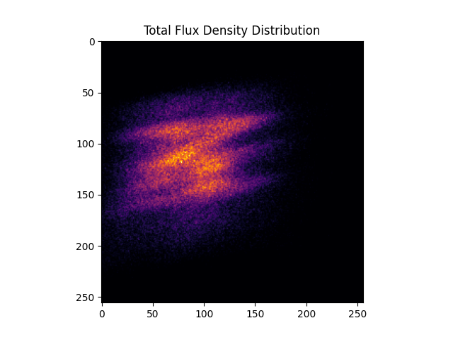

.. _tutorial_distributed_raytracing:

``ARTIST`` Tutorial: Distributed Ray Tracing
===========================================

.. note::

    You can find the corresponding ``Python`` script for this tutorial here:
    https://github.com/ARTIST-Association/ARTIST/blob/main/tutorials/01_heliostat_raytracing_distributed_tutorial.py

This tutorial provides a brief introduction to ``ARTIST`` showcasing how the distributed environment is set up by performing distributed ray tracing.

It is best if you already know about the following processes in ``ARTIST``

- How to load a scenario.
- Aligning heliostats.
- Performing heliostat ray tracing to generate a flux density image on a target area.

If you need help with this look into our other tutorials such as the tutorial on :ref:`heliostat raytracing <tutorial_heliostat_raytracing>`.

General Remarks
---------------
The data structures in ``ARTIST`` are set up to handle all heliostat computations in parallel even when using a single device. For example if there are multiple heliostats
in the same scenario, all heliostats are aligned in the same step. The same is true for parts of the ray tracing. These calculations are internally implemented
as large matrix-multiplications, which are highly efficient when using PyTorch on GPUs. The distributed ray tracing takes this parallelization further and
can be used when its desired to calculate parallel on multiple devices. The Heliostat-Tracing process can be distributed and parallelized using Distributed Data Parallel.
For the distributed ray tracing using DDP, the heliostat field is duplicated across all devices and the rays are separated into unique groups.
The distributed devices handle only a portion of the overall rays but they have access to the whole heliostat field. Each ray in the scenario belongs to a certain
heliostat, for ray tracing with DDP the rays are split along the heliostat dimension. This means each rank handles the rays of specific heliostats.
Overly simplified, in a scenario with 2000 heliostats and 4 ranks, this can be imagined as the first rank handling all rays of the first 500 heliostats and so on.


The mapping between active heliostats, target areas and incident ray directions.
--------------------------------------------------------------------------------
``ARTIST`` offers the flexibility, to activate and deactivate certain helisotats in the scenario, to have some heliostats aim at one target area, while others aim
elsewhere and also to have different incident ray directions for different heliostats in the same alignment and raytracing process. Differing incident ray
directions for different heliostats may not make much sense in the usual operation of the power plant, but this is very useful for calibration tasks.
To map each helisotat with its designated target area and incident ray direction you can use a mapping of this kind:

.. code-block::

    heliostat_target_light_source_mapping_string = [
        ("heliostat_name_1", "target_name_3", incident_ray_direction_tensor_1),
        ("heliostat_name_2", "target_name_1", incident_ray_direction_tensor_1),
        ("heliostat_name_3", "target_name_2", incident_ray_direction_tensor_2),
        ("heliostat_name_4", "target_name_1", incident_ray_direction_tensor_3),
    ]

If no mapping is provided, a default mapping for all heliostats within this group will be created. The default mapping will map all heliostats to the default
``single_incident_ray_direction``, which simualtes a light source positioned in the south and the default ``single_target_area_index``, which is 0. To overwrite
these defaults, please provide a ``single_incident_ray_direction`` or a ``single_target_area_index``.

The Distributed Environment
---------------------------
Based on the available devices, the environment is initialized with the appropriate communication backend.
For computation on GPUs the ``nccl`` backend optimized for NVIDIA GPUs is chosen. For computation on CPUs ``gloo`` is used as backend.
If the program is run without the intention of being distributed, the world size will be set to 1, accordingly the only rank is 0.
All of this is handled by running the following code:

.. code-block::

    # The distributed environment is setup and destroyed using a Generator object.
    environment_generator = setup_global_distributed_environment(device=device)

    device, is_distributed, rank, world_size = next(environment_generator)

This completely sets up the distributed environment. To use it during the ray tracing process, we initialize the
``HeliostatRayTracer`` slightly different than before:

.. code-block::

    # Create a ray tracer.
    ray_tracer = HeliostatRayTracer(
        scenario=scenario,
        heliostat_group=heliostat_group,
        world_size=world_size,
        rank=rank,
        batch_size=4,
        random_seed=rank,
        bitmap_resolution_e=bitmap_resolution_e,
        bitmap_resolution_u=bitmap_resolution_u,
    )


We can specify the ``world_size`` and the ``rank`` because both were set up earlier.
The ``HeliostatRayTracer`` handles all the parallelization for you. The ray tracing process is distributed over the defined number
ranks. Each rank handles a portion of the overall rays. The ``batch_size`` is an important parameter determining the performance of the
ray tracer. It determines how many heliostats are computed parallel in the large matrix-multiplications. If the ray tracing is not distributed
and the ``batch_size`` is 1, the ray tracing happens sequentially, if the ``batch_size`` equals the number of heliostats, the ray tracing happens
simultaneously for all heliostats. As the ``batch_size`` increases from 1 to the number of heliostats, the execution becomes faster but needs more
memory space. If the ray tracing is distributed and there are multiple ranks, the ``batch_size`` determines how many heliostats are parallelized within
each rank.

**Example**
Let's say there are four heliostats in our scenario. The ``world_size`` is four. We will now have four individual ``ranks`` that perform heliostat ray tracing in parallel.
Since we are using Distributed Data Parallel, each ``rank`` is assigned an exact copy of whole heliostat field in our scenario, meaning each ``rank`` can
access all four heliostats. The data, in our case the rays belonging to each heliostat, are split up and each ``rank`` handles a portion of them.
Each ray is assigned to exactly one ``rank``, no ray is duplicated. The rays from the first heliostat go to rank number 0, the rays for the second heliostat go
to rank number 1 and so on. If we were to plot the results of all four distributed ray tracings of the separate ``ranks``, we get these
Flux Density Distributions, each flux belongs to one heliostat:

+------------------------+------------------------+------------------------+------------------------+
| .. image:: ./images/distributed_flux_rank_0.png | .. image:: ./images/distributed_flux_rank_1.png |
|    :scale: 25%                                  |    :scale: 25%                                  |
|                                                 |                                                 |
+------------------------+------------------------+------------------------+------------------------+
| .. image:: ./images/distributed_flux_rank_2.png | .. image:: ./images/distributed_flux_rank_3.png |
|    :scale: 25%                                  |    :scale: 25%                                  |
|                                                 |                                                 |
+------------------------+------------------------+------------------------+------------------------+

The only step left is to add up all of those bitmaps to receive the total Flux Density Distribution from the considered heliostats:

.. code-block::

    if is_distributed:
        torch.distributed.all_reduce(
            group_bitmaps_per_heliostat, op=torch.distributed.ReduceOp.SUM
        )

The total Flux Density Distribution now looks like this:



Cleaning up the Distributed Environment
---------------------------------------
When trying to initialize another distributed task in the same program by creating another process group,
it is important to make sure that the two groups do not get mixed up. This is why we should explicitly
destroy the process group used for the ray tracing after we are done using it.
This is also handled by the ``environment_generator`` we set up in the beginning of this tutorial.
Simply execute the following code and you are done:

.. code-block::

    # Make sure the code after the yield statement in the environment Generator
    # is called, to clean up the distributed process group.
    try:
        next(environment_generator)
    except StopIteration:
        pass


Further Information
-------------------
The heliostat ray tracing parallelization with DDP parallelizes over the number of heliostats in the scenario.
During the initialization of the ``HeliostatRayTracer``, a ``DistortionsDataset`` is set up. This dataset is
later handed to a distributed sampler and a distributed data loader which distribute individual parts of
the dataset among the distributed ranks. The ``DistortionsDataset`` samples ray distortions according to the
parameters in the ``lightsource``. In the end the dataset contains a tuple of ray distortions in the east and up direction.
If we inspect one element of the dataset tuple for example ``distortions_e`` (and everything is the same for ``distortions_u```),
we see that it is a multi-dimensional tensor of shape ``(number of heliostats, number of rays per point, number of surface points per facet)``.
This means for each surface point on each heliostat we sample ``number_of_rays`` different ray distortions.
As defined in the ``DistortionsDataset``, the length of the dataset always equals to ``number_of_heliostats``. The dataset is split
by the sampler and loader along this dimension. If the ``number_of_heliostats`` is only one, the dataset cannot be split, all rays go
to ``rank`` zero, even if you parallelize with four ranks. ``rank`` one to n will be idle.
If the ``number_of_heliostats`` is greater or equal to the ``world_size``, all ranks will receive data.
