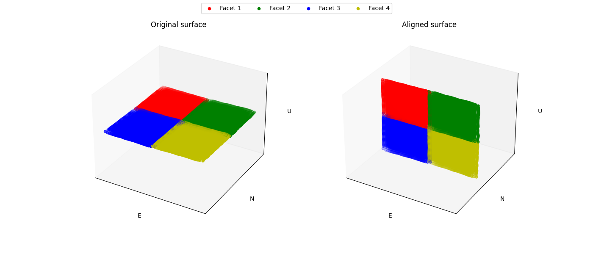
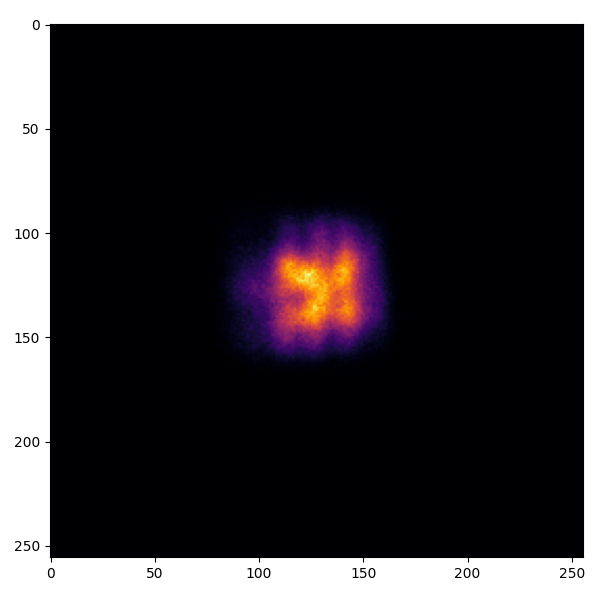
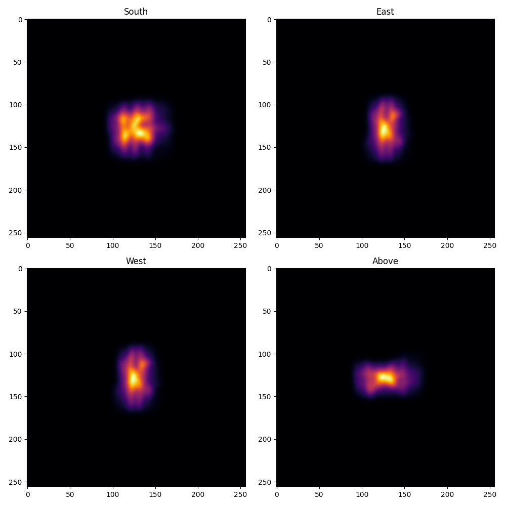

.. _tutorial_heliostat_raytracing:

``ARTIST`` Tutorial: Single Heliostat Ray Tracing
=================================================

.. note::

    You can find the corresponding ``Python`` script for this tutorial here:
    https://github.com/ARTIST-Association/ARTIST/blob/main/tutorials/01_single_heliostat_raytracing_tutorial.py

This tutorial provides a brief introduction to ``ARTIST`` and demonstrates how heliostat ray tracing is performed for a
single heliostat. The tutorial walks through several basic concepts necessary for understanding ``ARTIST``, including:

- How to load a scenario.
- How to select specific heliostats for alignment and ray tracing.
- Activating the heliostat kinematics to align the heliostat for ray tracing.
- Performing heliostat ray tracing to generate flux density images on the tower target areas.

.. warning::

    This tutorial is specifically designed to help you get a feel for ``ARTIST`` and therefore only works for scenarios
    containing a single heliostat. This is not how ``ARTIST`` is typically used in practice. For a more complete
    overview, consider the :ref:`tutorial on distributed ray tracing<tutorial_distributed_raytracing>`.

Loading a Scenario
------------------
You can load any scenario for this tutorial, as long as it only contains a single heliostat. In the ``data/scenarios``
folder located within the tutorials directory, we have included a `single_heliostat_scenario.h5` file that can be used
with this tutorial.

Please adjust the path and name of the ``scenario_path`` variable:

.. code-block::

    # Specify the path to your scenario.h5 file.
    scenario_path = pathlib.Path("please/insert/the/path/to/the/scenario/here/scenarios/single_heliostat_scenario.h5")

Once you have adjusted this parameter, you can load a scenario in ``ARTIST`` by calling the
``load_scenario_from_hdf5()`` method. This method is a ``Python`` ``classmethod`` that initializes a ``Scenario``
object based on the configuration contained in the HDF5 file:

.. code-block::

    # Load the scenario.
    with h5py.File(scenario_path) as scenario_path:
        scenario = Scenario.load_scenario_from_hdf5(
            scenario_file=scenario_path, device=device
        )

When loading the scenario, a large number of log messages are generated:

.. code-block::

    [2025-09-11 15:37:53,799][artist.scenario.scenario][INFO] - Loading an ``ARTIST`` scenario HDF5 file. This scenario file is version 1.0.
    [2025-09-11 15:37:53,799][artist.field.tower_target_areas][INFO] - Loading the tower target areas from an HDF5 file.
    [2025-09-11 15:37:53,799][artist.field.tower_target_areas][WARNING] - No curvature in the east direction set for the receiver!
    [2025-09-11 15:37:53,799][artist.field.tower_target_areas][WARNING] - No curvature in the up direction set for the receiver!
    [2025-09-11 15:37:53,799][artist.scene.light_source_array][INFO] - Loading a light source array from an HDF5 file.
    [2025-09-11 15:37:53,799][artist.scene.sun][INFO] - Loading sun_1 from an HDF5 file.
    [2025-09-11 15:37:53,800][artist.scene.sun][INFO] - Initializing a sun modeled with a multivariate normal distribution.
    [2025-09-11 15:37:53,920][artist.scenario.scenario][WARNING] - No individual kinematics first_joint_translation_e for None set. Using default values!
    [2025-09-11 15:37:53,920][artist.scenario.scenario][WARNING] - No individual kinematics first_joint_translation_n for None set. Using default values!
    [2025-09-11 15:37:53,921][artist.scenario.scenario][WARNING] - No individual kinematics first_joint_translation_u for None set. Using default values!
    [2025-09-11 15:37:53,921][artist.scenario.scenario][WARNING] - No individual kinematics first_joint_tilt_e for None set. Using default values!
    [2025-09-11 15:37:53,921][artist.scenario.scenario][WARNING] - No individual kinematics first_joint_tilt_n for None set. Using default values!
    [2025-09-11 15:37:53,921][artist.scenario.scenario][WARNING] - No individual kinematics first_joint_tilt_u for None set. Using default values!
    [2025-09-11 15:37:53,921][artist.scenario.scenario][WARNING] - No individual kinematics second_joint_translation_e for None set. Using default values!
    [2025-09-11 15:37:53,921][artist.scenario.scenario][WARNING] - No individual kinematics second_joint_translation_n for None set. Using default values!
    [2025-09-11 15:37:53,921][artist.scenario.scenario][WARNING] - No individual kinematics second_joint_translation_u for None set. Using default values!
    [2025-09-11 15:37:53,921][artist.scenario.scenario][WARNING] - No individual kinematics second_joint_tilt_e for None set. Using default values!
    [2025-09-11 15:37:53,921][artist.scenario.scenario][WARNING] - No individual kinematics second_joint_tilt_n for None set. Using default values!
    [2025-09-11 15:37:53,921][artist.scenario.scenario][WARNING] - No individual kinematics second_joint_tilt_u for None set. Using default values!
    [2025-09-11 15:37:53,921][artist.scenario.scenario][WARNING] - No individual kinematics concentrator_translation_e for None set. Using default values!
    [2025-09-11 15:37:53,921][artist.scenario.scenario][WARNING] - No individual kinematics concentrator_translation_u for None set. Using default values!
    [2025-09-11 15:37:53,921][artist.scenario.scenario][WARNING] - No individual kinematics concentrator_translation_n for None set. Using default values!
    [2025-09-11 15:37:53,921][artist.scenario.scenario][WARNING] - No individual kinematics concentrator_tilt_e for None set. Using default values!
    [2025-09-11 15:37:53,921][artist.scenario.scenario][WARNING] - No individual kinematics concentrator_tilt_n for None set. Using default values!
    [2025-09-11 15:37:53,921][artist.scenario.scenario][WARNING] - No individual kinematics concentrator_tilt_u for None set. Using default values!
    [2025-09-11 15:37:53,921][artist.field.heliostat_field][INFO] - Loading a heliostat field from an HDF5 file.
    [2025-09-11 15:37:53,922][artist.field.heliostat_field][INFO] - Individual surface parameters not provided - loading a heliostat with the surface prototype.
    [2025-09-11 15:37:53,922][artist.field.heliostat_field][INFO] - Individual kinematics configuration not provided - loading a heliostat with the kinematics prototype.
    [2025-09-11 15:37:53,922][artist.field.heliostat_field][INFO] - Individual actuator configurations not provided - loading a heliostat with the actuator prototype.
    [2025-09-11 15:37:53,940][artist.field.heliostat_field][INFO] - Added a heliostat group with kinematics type: rigid_body, and actuator type: ideal, to the heliostat field.

These log messages consist of three brackets:

   - The first bracket, e.g., ``[2025-09-11 15:37:53,799]``, displays the time stamp.
   - The second bracket, e.g., ``[artist.util.scenario]``, displays the module that generated the log message.
   - The third bracket, e.g., ``[INFO]`` or ``[WARNING]``, displays the log level.
   - Finally, the actual log message is printed after the three brackets.

While there are quite a few log messages, there are two important aspects you should note:

   1. The majority of the messages are warnings. However, this is not a problem. We are considering a simplified
      scenario and therefore do not include specific kinematics or actuator parameters or deviations. As a result,
      ``ARTIST`` automatically uses the default values. In this case, this behavior is expected and we can ignore the
      warnings.
   2. The remaining messages are info messages. These messages indicate which objects are being loaded from the HDF5
      file and provide additional details about them.

Before we start using this scenario, we can inspect it, for example, by printing the scenario properties or checking
which type of light source and target area is included:

.. code-block::

    # Inspect the scenario.
    print(scenario)
    print(
        f"The light source is a {scenario.light_sources.light_source_list[index_mapping.first_light_source].__class__.__name__}."
    )
    print(f"The first target area is a {scenario.target_areas.names[index_mapping.first_target_area]}.")
    print(
        f"The first heliostat in the first group in the field is {scenario.heliostat_field.heliostat_groups[index_mapping.first_heliostat_group].names[index_mapping.first_heliostat]}."
    )
    print(
        f"The location of {scenario.heliostat_field.heliostat_groups[index_mapping.first_heliostat_group].names[index_mapping.first_heliostat]} is: {scenario.heliostat_field.heliostat_groups[index_mapping.first_heliostat_group].positions[index_mapping.first_heliostat].tolist()}."
    )

This code generates the following output:

.. code-block::

    ARTIST Scenario containing:
        A Power Plant located at: [0.0, 0.0, 0.0] with 1 Target Area(s), 1 Light Source(s), and 1 Heliostat(s).
    The light source is a Sun.
    The first target area is a receiver.
    The first heliostat in the first group in the field is heliostat_1.
    The location of heliostat_1 is: [0.0, 5.0, 0.0, 1.0].

Selecting Active Heliostats and Target Areas
--------------------------------------------
In ``ARTIST``, heliostat information is stored per property. For example, there is one tensor containing all heliostat
positions for a specific heliostat group (see :ref:`Artist Under the Hood<artist_under_hood>`). Similarly, there is one
tensor containing all aim points, and so on. To address a specific heliostat, it is important to know its index.

To activate one or more heliostats for the alignment process or ray tracing, you can mark the entry at the corresponding
heliostat index with a 1 in the ``active_heliostats_mask`` tensor:

.. code-block::

    active_heliostats_mask = torch.tensor([1], dtype=torch.int32, device=device)

Then we activate these heliostats by calling the ``activate_heliostats()`` method:

.. code-block::

    # Activate the heliostat. Only activated heliostats will be aligned or ray-traced.
    scenario.heliostat_field.heliostat_groups[index_mapping.first_heliostat_group].activate_heliostats(
        active_heliostats_mask=active_heliostats_mask,
        device=device,
    )

The same is true for the target areas.

.. code-block::

    # We select the first target area as the designated target for this heliostat.
    target_area_indices = torch.tensor([0], device=device)

Now, we can define the aim point as this target area's center:

.. code-block::

    # Use the center of the selected target area as the aim point.
    aim_point = scenario.target_areas.centers[target_area_mask]
    print(f"The initial aim point used for this ray tracing is {aim_point.tolist()}.")

This produces the following output:

.. code-block::

    The initial aim point used for this raytracing is [[0.0, -50.0, 0.0, 1.0]]

indicating that the aim point is in the south.

Aligning Heliostats
--------------------
Before we can start ray tracing, we need to align the heliostats. In the current scenario, our heliostat is
initialized pointing straight up at the sky. Unfortunately, this orientation is not very useful for reflecting
sunlight from the sun onto the receiver located in the south (see the aim point above).

Therefore, we make use of our knowledge regarding the

- position of the heliostats,
- aim points, and
- kinematics model

to align the heliostats in an optimal orientation for reflection. To perform this orientation, we need an incident ray
direction, i.e., a direction vector originating from the light source and pointing towards the heliostat field.
``ARTIST`` can accommodate heliostats with various kinematics and actuator types. Since each kinematics type and
actuator type computes the orientations of aligned heliostats slightly differently, we need to separate the heliostats
into ``HeliostatGroup`` objects. ``ARTIST`` handles this grouping automatically.

We first consider a scenario where the sun is also directly in the south, i.e., the incident ray direction points
towards the north. When defining this direction, we have to make sure the vector is normalized:

.. code-block::

    # Incident ray directions need to be normalized.
    incident_ray_directions = torch.tensor([[0.0, 1.0, 0.0, 0.0]], device=device)

Given this incident ray direction, we can align the heliostats with the following code:

.. code-block::

    # Align the heliostat(s).
    scenario.heliostat_field.heliostat_groups[
        index_mapping.first_heliostat_group
    ].align_surfaces_with_incident_ray_directions(
        aim_points=aim_point,
        incident_ray_directions=incident_ray_directions,
        active_heliostats_mask=active_heliostats_mask,
        device=device,
    )

We can compare the original surface and the aligned surface of the first heliostat in the heliostat field
in the following plot:

Since both the target area (receiver) and the sun are directly to the south of the heliostat field, this alignment is
completely plausible. The heliostat rotates 90 degrees along the east axis to reflect the incoming sunlight back in the direction
it is coming from and thus toward the receiver.

Ray Tracing
-----------
With the heliostats now aligned, it is time to perform ray tracing to generate flux density images.

In this tutorial, we consider *heliostat ray tracing*. Heliostat ray tracing (as its name suggests) traces rays of
sunlight starting from the heliostat. If we were to trace rays from the sun, only a small portion would hit the
heliostat, and an even smaller portion of these rays would reach the receiver. Therefore, heliostat ray tracing can be
significantly more computationally efficient. Concretely, heliostat ray tracing involves three main steps:

1. We calculate the preferred reflection directions of all heliostats. This preferred reflection direction models the
   direction of a ray coming directly from the sun to the heliostat, i.e., along the incident ray direction.
   Specifically, this incident ray is reflected at every point on the heliostat surface to generate multiple *ideal*
   reflections.
2. This single ray only models an *ideal* direction, in reality the sun emits rays from many slightly different
   directions.
   Therefore, we use our model of the sun to generate *distortions*, which we use to slightly perturb the preferred
   reflection directions multiple times, thus generating many realistically reflected rays.
3. We trace these rays onto the target area by performing a *line-plane intersection* and computing the resulting flux
   density image on the receiver.

Luckily, ``ARTIST`` automatically performs all of these steps within the ``HeliostatRayTracer`` class. Therefore, ray
tracing with ``ARTIST`` involves only two simple lines of code. First, we define the ``HeliostatRayTracer``. A
``HeliostatRayTracer`` requires a ``Scenario`` object and the specification of the ``HeliostatGroup`` that is currently
being considered.

.. code-block::

    # Create a ray tracer.
    ray_tracer = HeliostatRayTracer(
        scenario=scenario,
        heliostat_group=scenario.heliostat_field.heliostat_groups[index_mapping.first_heliostat_group],
    )

Internally, a ``HeliostatRayTracer`` uses a ``torch.Dataset`` to generate rays, apply distortions to the preferred
reflection directions, perform line-plane intersections, and compute the resulting flux density images. This process
runs parallel for all heliostats in the scenario. It is also possible to use a data-parallel setup for the
``HeliostatRayTracer`` to split the computation across multiple devices. See the tutorial on
:ref:`distributed raytracing <tutorial_distributed_raytracing>`.

With everything now set up, we can generate a flux density image by calling the ``trace_rays()`` function with the
desired incident ray directions, the active heliostat indices and the target area indices (for this tutorial we use the
receiver).

.. code-block::

    # Perform heliostat-based ray tracing.
    image_south = ray_tracer.trace_rays(
        incident_ray_directions=incident_ray_directions,
        active_heliostats_mask=active_heliostats_mask,
        target_area_mask=target_area_mask,
        device=device,
    )

If we plot the output, we get the following flux density image:

That's it – a simple example of heliostat ray tracing with ``ARTIST``!

Of course, this scenario can perform ray tracing for any incident ray direction. For example, we can consider
three additional incident ray directions and perform ray tracing using a helper function that combines alignment and
ray tracing:

.. code-block::

    # Define light directions.
    incident_ray_direction_east = torch.tensor([[-1.0, 0.0, 0.0, 0.0]], device=device)
    incident_ray_direction_west = torch.tensor([[1.0, 0.0, 0.0, 0.0]], device=device)
    incident_ray_direction_above = torch.tensor([[0.0, 0.0, -1.0, 0.0]], device=device)

    # Perform alignment and ray tracing to generate flux density images.
    image_east = align_and_trace_rays(
        light_direction=incident_ray_direction_east,
        active_heliostats_mask=active_heliostats_mask,
        target_area_mask=target_area_mask,
        device=device,
    )
    image_west = align_and_trace_rays(
        light_direction=incident_ray_direction_west,
        active_heliostats_mask=active_heliostats_mask,
        target_area_mask=target_area_mask,
        device=device,
    )
    image_above = align_and_trace_rays(
        light_direction=incident_ray_direction_above,
        active_heliostats_mask=active_heliostats_mask,
        target_area_mask=target_area_mask,
        device=device,
    )

Ploting the results of all four considered incident ray directions produces the following image:

We hope this tutorial gave you an idea of how ``ARTIST`` works – check out further tutorials for a more in-depth
demonstration of what you can do with our software.

.. note::

    The images generated in this tutorial are for illustrative purposes, often with reduced resolution and without
    hyperparameter optimization. Therefore, they should not be interpreted as a measure of the quality of ``ARTIST``.
    Please see our publications for further information.
