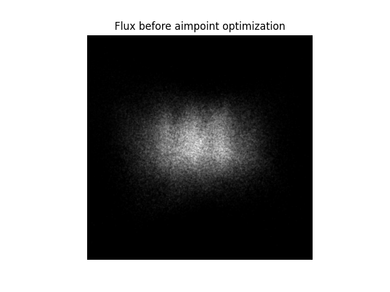
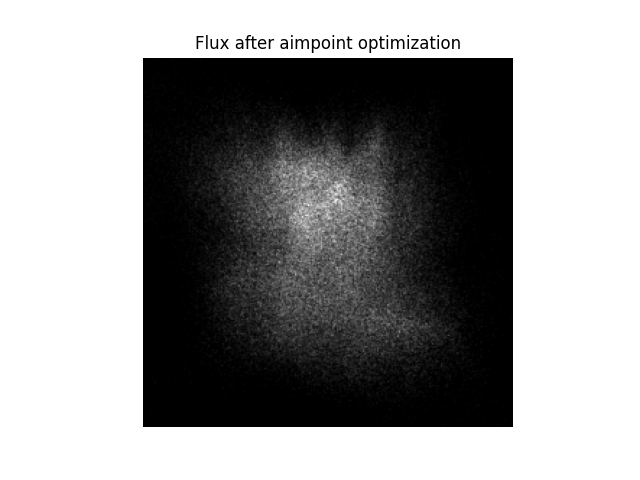

.. _tutorial_motor_position_optimization:

``ARTIST`` Tutorial: Motor Position Optimization
================================================

.. note::

    You can find the corresponding ``Python`` script for this tutorial here:
    https://github.com/ARTIST-Association/ARTIST/blob/main/tutorials/05_motor_positions_optimizer_tutorial.py

This tutorial demonstrates how to optimize heliostat motor positions in ``ARTIST``, which is a crucial step for precise
heliostat alignment and maximizing power plant efficiency.

The tutorial will walk you through the key concepts needed to perform this optimization, including:

- Defining the ground truth and the loss function,
- configuring the optimization parameters, and
- performing the motor positions optimization.

Before starting, make sure you know how to :ref:`load a scenario<tutorial_heliostat_raytracing>`,
run ``ARTIST`` in a :ref:`distributed environment<tutorial_distributed_raytracing>`, and understand the structure of a
:ref:`scenario<scenario>`. If you are not using your own scenario, we recommend using either

- ``test_scenario_paint_multiple_heliostat_groups_deflectometry.h5`` or
- ``test_scenario_paint_multiple_heliostat_groups_ideal.h5``

provided in the ``scenarios/`` folder.

You should also have your scenario loaded and the distributed environment set up, as shown in previous tutorials.

Motor Position Optimization
---------------------------
Motor position optimization adjusts the motor positions of all heliostats in the field to achieve a desired flux
distribution on the solar tower. In this tutorial, we target a trapezoid distribution on the receiver, i.e., all regions should get
approximately the same amount of sunlight. The resulting optimal flux density distribution maximizes the plant's energy
yield and prevents local overheating.

Below, we define the targeted trapezoid distribution as the ground truth:

.. code-block:: python

    e_trapezoid = utils.trapezoid_distribution(
        total_width=256, slope_width=30, plateau_width=110, device=device
    )
    u_trapezoid = utils.trapezoid_distribution(
        total_width=256, slope_width=30, plateau_width=110, device=device
    )
    ground_truth = u_trapezoid.unsqueeze(
        index_mapping.unbatched_bitmap_u
    ) * e_trapezoid.unsqueeze(index_mapping.unbatched_bitmap_e)

Flux Scaling
^^^^^^^^^^^^

As we typically want to maximize the energy on the receiver while optimally distributing the single heliostat fluxes,
the flux integral is an essential quantity in motor position optimization. To simulate the energy on the receiver, each
ray needs to be assigned a meaningful magnitude. This is done by providing the ``dni`` parameter in the
``MotorPositionsOptimizer``. The direct normal irradiance (DNI) is the insolation at a given location on Earth with a
surface element perpendicular to the sun's rays, excluding diffuse insolation. It is provided in W/m^2 and automatically
converted to ray magnitudes.

For the optimization, the targeted ``ground_truth`` distribution is scaled with the scalar ``target_flux_integral``
value:

.. code-block:: python

    # Set target flux integral.
    canting_norm = (
        torch.norm(scenario.heliostat_field.heliostat_groups[0].canting[0], dim=1)[0]
    )[:2]
    dimensions = (canting_norm * 4) + 0.02
    heliostat_surface_area = dimensions[0] * dimensions[1]
    total_heliostat_area = (
        heliostat_surface_area
        * scenario.heliostat_field.number_of_heliostats_per_group.sum()
    )
    target_flux_integral = (
        dni * total_heliostat_area * 0.75
    )  # account for mirror and angle based losses.

Loss Function
^^^^^^^^^^^^^

We again use the ``KLDivergenceLoss`` as the loss function:

.. code-block:: python

    loss_definition = KLDivergenceLoss()

The ``KLDivergenceLoss`` measures the difference between the predicted flux distribution generated by all heliostats in
the scenario and the reference trapezoid distribution.

Optimization Configuration
^^^^^^^^^^^^^^^^^^^^^^^^^^
Before we can perform the optimization, we need to define the optimization configuration.
Internally, ``ARTIST`` uses the ``torch.optim.Adam`` optimizer. We use the following scheduler and optimization
settings:

.. code-block:: python

    # Set optimizer parameters.
    optimizer_dict = {
        config_dictionary.initial_learning_rate: 3e-4,
        config_dictionary.tolerance: 0.0005,
        config_dictionary.max_epoch: 30,
        config_dictionary.batch_size: 50,
        config_dictionary.log_step: 3,
        config_dictionary.early_stopping_delta: 1e-4,
        config_dictionary.early_stopping_patience: 100,
        config_dictionary.early_stopping_window: 100,
    }
    # Configure the learning rate scheduler.
    scheduler_dict = {
        config_dictionary.scheduler_type: config_dictionary.reduce_on_plateau,
        config_dictionary.gamma: 0.9,
        config_dictionary.lr_min: 1e-6,
        config_dictionary.lr_max: 1e-3,
        config_dictionary.step_size_up: 500,
        config_dictionary.reduce_factor: 0.3,
        config_dictionary.patience: 100,
        config_dictionary.threshold: 1e-3,
        config_dictionary.cooldown: 10,
    }
    # Configure the regularizers and constraints.
    constraint_dict = {
        config_dictionary.rho_flux_integral: 1.0,
        config_dictionary.rho_local_flux: 1.0,
        config_dictionary.rho_intercept: 1.0,
        config_dictionary.max_flux_density: 1000000,
    }
    # Combine configurations.
    optimization_configuration = {
        config_dictionary.optimization: optimizer_dict,
        config_dictionary.scheduler: scheduler_dict,
        config_dictionary.constraints: constraint_dict,
    }

The optimization configuration is a combination of optimizer parameters, scheduler parameters, and the learning
constraints.

Constraints
^^^^^^^^^^^
For the motor position optimization, we have two constraints:

- **Flux integral constraints:** Controlled by ``rho_energy`` and ``lambda_lr`` to encourage maximizing the flux
  integral and thus total energy using an Augmented Lagrangian.
- **Pixel-level flux constraints:** Controlled by ``max_flux_density`` (maximum allowed flux density per pixel) and
  ``rho_pixel`` (penalty strength for exceeding the limit) to constrain the flux at the pixel level. This is
  particularly important because, in a real power plant, the receiver has strict safety limits on the flux density to
  avoid material damage.

Running the Optimizer
^^^^^^^^^^^^^^^^^^^^^
Finally, we create a ``MotorPositionsOptimizer`` object and run the optimization:

.. code-block:: python

    # Create the motor positions optimizer.
    motor_positions_optimizer = MotorPositionsOptimizer(
        ddp_setup=ddp_setup,
        scenario=scenario,
        optimization_configuration=optimization_configuration,
        incident_ray_direction=torch.tensor([0.0, 1.0, 0.0, 0.0], device=device),
        target_area_index=1,
        ground_truth=ground_truth,
        dni=dni,
        device=device,
    )

    # Optimize the motor positions.
    final_loss, _, _, _, _ = motor_positions_optimizer.optimize(
        loss_definition=loss_definition, device=device
    )

The ``optimize()`` method returns the final loss of the optimization process, which can be useful for logging or further
analysis.

The Effect of Motor Position Optimization
-----------------------------------------

To better understand why motor position optimization is important let's consider a small example. Receivers are designed
and constructed with a known optimal distribution in mind. This distribution might be a homogenous distribution or
something similar. The aim is to realize this optimal distribution with all heliostats in the field. Here, we aim to
achieve a uniform distribution. However, the flux distribution before motor position optimization is clearly uneven:

During motor position optimization, the heliostats are adjusted to aim at slightly different points on the receiver.
This improves the uniformity of the flux distribution on the receiver:

Despite only a few heliostats being present in this scenario, the flux distribution is visibly more uniform after
the optimization. Note that due to the small number of heliostats, it is impossible to actually achieve the desired
uniform flux distribution – but we clearly see that the flux after the optimization is more broadly distributed than
before.

.. note::

    The images generated in this tutorial are for illustrative purposes, often with reduced resolution and without
    hyperparameter optimization. Therefore, they should not be taken as a measure of the quality of ``ARTIST``. Please
    see our publications for further information.
