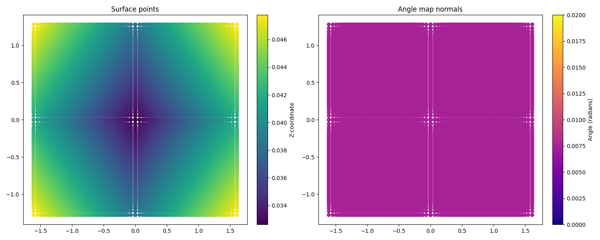
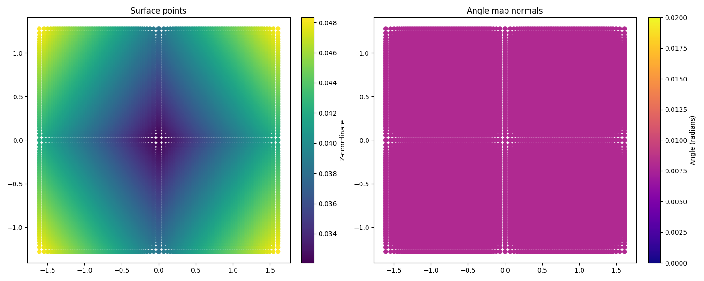
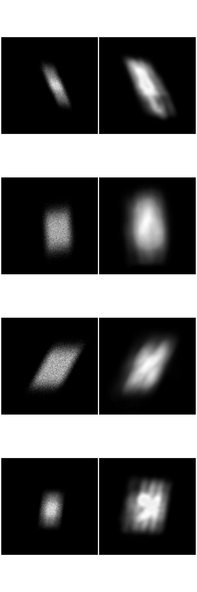
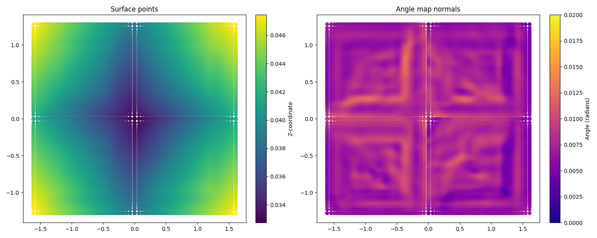
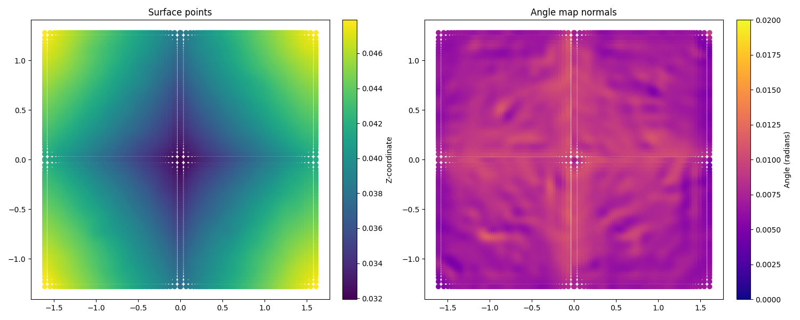
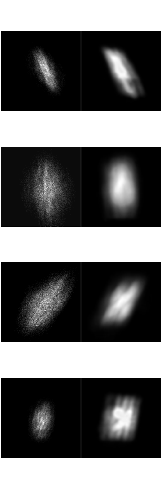

.. _tutorial_surface_reconstruction:

``ARTIST`` Tutorial: Surface Reconstruction
===========================================

.. note::

  You can find the corresponding ``Python`` script for this tutorial here:
  https://github.com/ARTIST-Association/ARTIST/blob/main/tutorials/03_nurbs_surface_reconstruction_tutorial.py

This tutorial demonstrates how a heliostat surface can be reconstructed using Non-Uniform Rational B-Splines (NURBS) in
``ARTIST``. It introduces the key steps involved in the reconstruction workflow, including:

- loading the data required for surface reconstruction,
- defining the loss functions and regularizers used during optimization,
- configuring the optimizer and learning rate scheduler, and
- performing the surface reconstruction.

Before starting this tutorial, make sure you are familiar with how to
:ref:`load a scenario<tutorial_heliostat_raytracing>`, run ``ARTIST`` in a
:ref:`distributed environment<tutorial_distributed_raytracing>`, and understand the structure of a
:ref:`scenario<scenario>`.

If you are not using your own scenario, we recommend using the
``test_scenario_paint_multiple_heliostat_groups_ideal.h5`` scenario provided in the ``scenarios/`` folder.

Loading Data
------------
As a first step, you must load the calibration properties and flux images data required for reconstructing the surfaces.
This information is specified in the ``heliostat_data_mapping`` list. Each entry in this list is a tuple containing the
heliostat name and the paths to its calibration data, which include both a calibration properties ``.json`` file and a
``.png`` flux image.

If you are not using your own data, you can use the sample data provided in the ``data/`` directory. For example, the
data for heliostats ``AA31``, ``AA39``, and ``AC43`` will work with the
``test_scenario_paint_multiple_heliostat_groups_ideal.h5`` scenario:

.. code-block:: python

    # Specify the heliostats to be calibrated and the paths to your calibration-properties.json files.
    # Please use the following style: list[tuple[str, list[pathlib.Path], list[pathlib.Path]]]
    heliostat_data_mapping = [
        (
            "heliostat_name_1",
            [
                pathlib.Path(
                    "please/insert/the/path/to/the/paint/data/here/calibration-properties.json"
                ),
                # ....
            ],
            [
                pathlib.Path("please/insert/the/path/to/the/paint/data/here/flux.png"),
                # ....
            ],
        ),
        (
            "heliostat_name_2",
            [
                pathlib.Path(
                    "please/insert/the/path/to/the/paint/data/here/calibration-properties.json"
                ),
                # ....
            ],
            [
                pathlib.Path("please/insert/the/path/to/the/paint/data/here/flux.png"),
                # ....
            ],
        ),
        # ...
    ]

This mapping is stored in a data dictionary together with the data parser. Later on, the dictionary will be used during
the optimization process:

.. code-block:: python

    # Create dict for the data parser and the heliostat_data_mapping.
    data: dict[
        str,
        CalibrationDataParser | list[tuple[str, list[pathlib.Path], list[pathlib.Path]]],
    ] = {
        config_dictionary.data_parser: PaintCalibrationDataParser(sample_limit=2),
        config_dictionary.heliostat_data_mapping: heliostat_data_mapping,
    }

Next, you can load the scenario and set up the distributed environment as in the previous tutorials.

Setting up the Optimization
---------------------------
Surface reconstruction in ``ARTIST`` is framed as an optimization problem. The goal is to reconstruct a heliostat
surface whose simulated flux distribution matches the measured calibration data. To achieve this, we define

- a loss function to measure the difference between the simulated flux distribution of the reconstructed surface and the
  measured calibration data, as well as
- regularizers that enforce physically meaningful surfaces, and
- constraints that stabilize the optimization process.

Loss Functions
^^^^^^^^^^^^^^

In this tutorial we use the ``KLDivergenceLoss`` as the loss function. This loss measures the difference between two
probability distributions. In our case, the measured flux density image used as the target is interpreted as a discrete
probability distribution and serves as the reference distribution. Alternatively, you can use the ``PixelLoss`` which
compares the simulated and measured flux images pixel-wise.

.. code-block::

    # Set loss function.
    loss_definition = KLDivergenceLoss()

Optimizer, Scheduler, Regularizer, and Constraints Configuration
^^^^^^^^^^^^^^^^^^^^^^^^^^^^^^^^^^^^^^^^^^^^^^^^^^^^^^^^^^^^^^^^

The surface reconstruction internally uses the ``torch.optim.Adam`` optimizer. Depending on the dataset and
reconstruction problem, different optimizer parameters and learning rate schedulers may lead to better results.
Below, we configure the optimizer parameters and define the learning rate scheduler. In this example, we use an
exponential scheduler. In practice, cyclic or reduce-on-plateau schedulers have also achieved good results.

.. code-block:: python

    # Configure the optimizer.
    optimizer_dict = {
        config_dictionary.initial_learning_rate: 1e-4,
        config_dictionary.tolerance: 1e-5,
        config_dictionary.max_epoch: 30,
        config_dictionary.batch_size: 30,
        config_dictionary.log_step: 1,
        config_dictionary.early_stopping_delta: 1e-4,
        config_dictionary.early_stopping_patience: 100,
        config_dictionary.early_stopping_window: 100,
    }
    # Configure the learning rate scheduler.
    scheduler_dict = {
        config_dictionary.scheduler_type: config_dictionary.exponential,
        config_dictionary.gamma: 0.99,
        config_dictionary.min: 1e-6,
        config_dictionary.max: 1e-2,
        config_dictionary.step_size_up: 100,
        config_dictionary.reduce_factor: 0.5,
        config_dictionary.patience: 10,
        config_dictionary.threshold: 1e-4,
        config_dictionary.cooldown: 5,
    }

Regularizers are used to prevent overfitting and ensure that the reconstructed surface is smooth and remains physically
plausible, i.e., similar to an ideal surface. We use two regularizers in the surface reconstruction:

``IdealSurfaceRegularizer``
  Pushes the reconstructed surface towards the shape of an ideal, perfectly flat or canted
  surface. Since the overall surface shape is typically known from the heliostat design, the reconstruction mainly
  focuses on small local deformations. This regularizer therefore discourages unrealistic large deviations from an ideal
  surface.
``SmoothnessRegularizer``
  Promotes smooth surfaces by penalizing large gradients between neighboring control points.
  The assumption is that real heliostat surfaces deform smoothly, making abrupt surface variations physically unlikely.

These regularizers are initialized automatically within the ``SurfaceReconstructor``. Their influence can be controlled
through the weights specified in the constraints dict. Setting a weight to zero disables the corresponding regularizer.

.. code-block:: python

    # Configure the regularizers and constraints.
    constraint_dict = {
        config_dictionary.weight_smoothness: 0.005,
        config_dictionary.weight_ideal_surface: 0.005,
        config_dictionary.rho_flux_integral: 1.0,
        config_dictionary.energy_tolerance: 0.01,
    }

In addition to the regularizers, ``ARTIST`` applies an *energy conservation constraint* to further stabilize the
reconstruction. This constraint ensures that the total flux integral of the simulated flux images does not change
significantly during optimization.

The parameter ``rho_flux_integral`` is a coefficient of an *Augmented Lagrangian formulation*
used to enforce this constraint. To understand the *Augmented Lagrangian formulation*, consider the parameter
``lambda_flux_integral`` which is set automatically inside the ``MotorPositionsOptimizer``. This is the Lagrange
multiplier associated with the flux integral constraint. It linearly penalizes deviations from the reference flux integral
and is updated iteratively during the optimization based on the current constraint violation. If the
simulated energy deviates more strongly from the reference energy, ``lambda_energy`` increases, thereby strengthening
the enforcement of the constraint in the next iteration.
For the ``constraint_dict`` we need to define:

``rho_flux_integral``
  The quadratic penalty weight controlling the strength of the squared constraint term.
``energy_tolerance``
  Specifies how much the flux integral may deviate relative to the initial surface.

Together, these parameters ensure that the reconstructed surface produces a flux distribution with a physically
consistent total energy.

We can now combine all optimization parameters in the ``optimization_configuration`` dictionary:

.. code-block:: python

    optimization_configuration = {
        config_dictionary.optimization: optimizer_dict,
        config_dictionary.scheduler: scheduler_dict,
        config_dictionary.constraints: constraint_dict,
    }

.. note::

  The parameters shown above have performed well for our data and experiments. However, optimal settings may vary
  depending on the calibration data and reconstruction scenario.

Performing Surface Reconstruction
---------------------------------
Now we are almost ready to perform the surface reconstruction. Since ``ARTIST`` internally uses ray tracing to generate
the flux images required for the loss calculation, we need to define several ray-tracing parameters. In particular, we
specify the ``number_of_rays``,  the ``number_of_surface_points``, and the bitmap ``resolution``. These parameters
control the resolution of the simulated flux images. Increasing them generally improves reconstruction accuracy but also
increases computation time.

.. code-block:: python

    scenario.set_number_of_rays(number_of_rays=120)
    number_of_surface_points = torch.tensor([100, 100], device=device)
    resolution = torch.tensor([256, 256], device=device)

With these parameters defined, we can instantiate a ``SurfaceReconstructor`` and start the optimization:

.. code-block:: python

    # Create the surface reconstructor.
    surface_reconstructor = SurfaceReconstructor(
        ddp_setup=ddp_setup,
        scenario=scenario,
        data=data,
        optimization_configuration=optimization_configuration,
        number_of_surface_points=number_of_surface_points,
        bitmap_resolution=resolution,
        device=device,
    )

    # Reconstruct surfaces.
    final_loss_per_heliostat, _ = surface_reconstructor.reconstruct_surfaces(
        loss_definition=loss_definition, device=device
    )

During this process, the NURBS parameters defining the heliostat surface are optimized and stored directly in the
scenario. The ``reconstruct_surfaces()`` method returns the loss per heliostat, which can be used to evaluate the
reconstruction quality.

What Does Surface Reconstruction Do?
------------------------------------

To better understand the effect of surface reconstruction, consider two heliostats that are initially loaded with ideal
surfaces (here referred to as Heliostat 1 and Heliostat 2):

The left side shows the coordinates of the surface points, with the ``z`` coordinate highlighted by the color scale.
As expected, the heliostats appear almost perfectly square, and the variation in ``z`` indicates the canting of the
facets.

The right side shows the surface normals. The color scale indicates the angle between each normal and a reference
direction. Because the surfaces are ideal, all normals have identical angles and no deformations are visible.

However, this situation is not realistic. When we compare the simulated flux images produced by these ideal surfaces
with the measured target images, we see that they do not match at all:

Although the overall shape of the flux distribution is captured, the internal structure of the flux pattern is missing.
This indicates that the real heliostat surfaces deviate from the ideal model. After performing surface reconstruction,
the surfaces of both heliostats adapt to better match the measured data:

While the surface points have only changed marginally, the surface normals now exhibit clear deviations. These changes
correspond to learned surface deformations that better represent the real heliostat geometry.

The resulting flux images reflect these improvements:

The reconstructed surfaces capture significantly more detail in the flux distribution. In practice, the reconstruction
quality can be further improved by adjusting hyperparameters, using a more realistic sun model, or increasing the number
of rays used in the simulation.
Heliostat surface reconstruction is a crucial step when creating a digital twin of a solar tower power plant, as is
allows the simulated optical behavior to match the real system more accurately.

That is all there is to surface reconstruction in ``ARTIST`` – hopefully this helped you understand how the process
works and the importance of this step.

.. note::

    The images generated in this tutorial are for illustrative purposes, often with reduced resolution and without
    hyperparameter optimization. Therefore, they should not be taken as a quality measure for ``ARTIST``. Please
    see our publications for further information.
