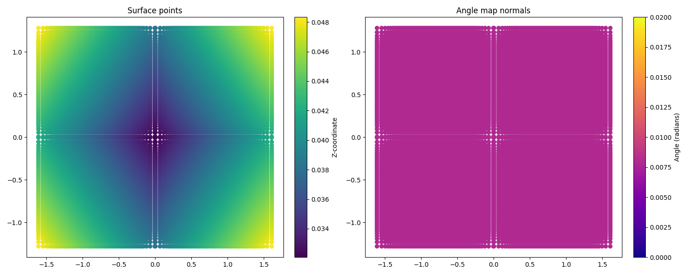

.. _tutorial_surface_reconstruction:

``ARTIST`` Tutorial: Surface Reconstruction
===========================================

.. note::

    You can find the corresponding ``Python`` script for this tutorial here:
    https://github.com/ARTIST-Association/ARTIST/blob/main/tutorials/03_nurbs_surface_reconstruction.py

This tutorial shows how a heliostat surface can be reconstructed using Non-Uniform Rational B-Splines (NURBS) in ``ARTIST``.

The tutorial will cover several concepts including:

- How to load the data required for the surface reconstruction.
- How to set up the loss functions and regularizers required for the surface reconstruction.
- How to configure the optimizer and learning rate scheduler.
- How to perform the surface reconstruction.

Before starting this scenario make sure you already know how to :ref:`load a scenario<tutorial_heliostat_raytracing>`,
run ``ARTIST`` in a :ref:`distributed environment<tutorial_distributed_raytracing>`, and understand the structure of a
:ref:`scenario<scenario>`. If you are not using your own scenario, we recommend using the
"test_scenario_paint_multiple_heliostat_groups_ideal.h5" scenario provided in the "scenarios" folder.

Loading Data
------------
To begin, you must load the calibration properties and flux images data required to reconstruct the surfaces.

This information is contained within the ``heliostat_data_mapping`` list of tuples, where each tuple contains the heliostat's
name and the paths to its calibration data, which include both a ``.json`` file with calibration properties and a ``.png`` flux image.

If you are not using your own data, you can use the sample data provided in the "data", for example for the heliostats
AA31, AA39, and AC43 - specifically, this data will also work with the "test_scenario_paint_multiple_heliostat_groups_ideal.h5"
scenario.

.. code-block::

    # Specify the heliostats to be calibrated and the paths to your calibration-properties.json files.
    # Please use the following style: list[tuple[str, list[pathlib.Path], list[pathlib.Path]]]
    heliostat_data_mapping = [
        (
            "heliostat_name_1",
            [
                pathlib.Path(
                    "please/insert/the/path/to/the/paint/data/here/calibration-properties.json"
                ),
                # ....
            ],
            [
                pathlib.Path("please/insert/the/path/to/the/paint/data/here/flux.png"),
                # ....
            ],
        ),
        (
            "heliostat_name_2",
            [
                pathlib.Path(
                    "please/insert/the/path/to/the/paint/data/here/calibration-properties.json"
                ),
                # ....
            ],
            [
                pathlib.Path("please/insert/the/path/to/the/paint/data/here/flux.png"),
                # ....
            ],
        ),
        # ...
    ]

This data is then saved into a data dictionary which will be later used in the optimization:

.. code-block::

    # Create dict for the data source name and the heliostat_data_mapping.
    data: dict[str, str | list[tuple[str, list[pathlib.Path], list[pathlib.Path]]]] = {
        config_dictionary.data_source: config_dictionary.paint,
        config_dictionary.heliostat_data_mapping: heliostat_data_mapping,
    }

Next, you can load the scenario and set up the distributed environment as in previous tutorials.

Setting up the Optimization
---------------------------
Surface reconstruction in ``ARTIST`` is framed as an optimization problem. This involves defining a loss function to
quantify the difference between the reconstructed surface and the calibration data, as well as regularizers to constrain
the solution and ensure a physically plausible result.

Loss Functions
^^^^^^^^^^^^^^

In this tutorial we use the ``KLDivergenceLoss`` as the loss function. This loss measures how one probability distribution
is different from a second, reference distribution. In this case, we consider the target flux density image as a discrete
distribution and use this as our target. Alternatively, you could also use the ``PixelLoss`` which compares each pixel
in the generated image individually.

.. code-block::

    # Set loss function.
    loss_definition = KLDivergenceLoss()

Regularizers
^^^^^^^^^^^^

Regularizers are used to prevent overfitting and ensure that the reconstructed surface is smooth and similar to an ideal
surface. In this tutorial we consider two regularizers:

- ``IdealSurfaceRegularizer``: Pushes the reconstructed surface towards the shape of an ideal, perfectly flat or canted surface. The idea here, is that we know the general canting and shape of a flat surface and what is unknown is the minute deformations. Therefore, any dramatic changes should be avoided and in general the learnt surface should be similar to the ideal surface, apart from these minute deviations.
- ``TotalVariationRegularizer``: This regularizer promotes smoothness by penalizing large gradients. The idea behind this regularize is that neighboring points on the surface should be similar, therefore very large differences between points is unrealistic. We apply this regularize to both the surface normals and the surface points.

.. code-block::

    # Configure regularizers and their weights.
    ideal_surface_regularizer = IdealSurfaceRegularizer(
        weight=0.5, reduction_dimensions=(1, 2, 3, 4)
    )
    total_variation_regularizer_points = TotalVariationRegularizer(
        weight=0.5,
        reduction_dimensions=(1,),
        surface=config_dictionary.surface_points,
        number_of_neighbors=64,
        sigma=1e-3,
    )
    total_variation_regularizer_normals = TotalVariationRegularizer(
        weight=0.5,
        reduction_dimensions=(1,),
        surface=config_dictionary.surface_points,
        number_of_neighbors=64,
        sigma=1e-3,
    )

Finally, these regularizers are added into a list which we will later use in the surface reconstruction:

.. code-block::

    regularizers = [
        ideal_surface_regularizer,
        total_variation_regularizer_points,
        total_variation_regularizer_normals,
    ]

Scheduler and Optimizer Configuration
^^^^^^^^^^^^^^^^^^^^^^^^^^^^^^^^^^^^^

The surface reconstruction internally uses the ``torch.optim.Adam`` optimizer. Depending on the data you use, different
parameters may perform better for the optimizer - including a different learning rate scheduler. Therefore, we first have
to define our learning rate schedular, here we use an exponential schedular, but good results have also been achieved with
an cyclic or reduce on plateau scheduler:

.. code-block::

    scheduler = (
        config_dictionary.exponential
    )
    scheduler_parameters = {
        config_dictionary.gamma: 0.9,
        config_dictionary.min: 1e-6,
        config_dictionary.max: 1e-3,
        config_dictionary.step_size_up: 500,
        config_dictionary.reduce_factor: 0.3,
        config_dictionary.patience: 10,
        config_dictionary.threshold: 1e-3,
        config_dictionary.cooldown: 10,
    }

Given the scheduler we can now define the optimization parameters in the ``optimization_configuration`` dictionary:

.. code-block::

    optimization_configuration = {
        config_dictionary.initial_learning_rate: 1e-4,
        config_dictionary.tolerance: 0.00005,
        config_dictionary.max_epoch: 500,
        config_dictionary.num_log: 50,
        config_dictionary.early_stopping_delta: 1e-4,
        config_dictionary.early_stopping_patience: 10,
        config_dictionary.scheduler: scheduler,
        config_dictionary.scheduler_parameters: scheduler_parameters,
        config_dictionary.regularizers: regularizers,
    }

**Note:** These parameters have performed well on our data and in our tests, however we cannot guarantee that they will
be applicable for different data sets or in different settings.

Performing Surface Reconstruction
---------------------------------
We are now almost ready to reconstruct the surface. However, since ``ARTIST`` uses raytracing internally to generate the
flux images required for the loss calculation, we need to define a few parameters for the raytracing. Specifically, the
``number_of_rays``,  the ``number_of_surface_points`` and the ``resolution`` of the bitmap. These parameters essentially
control the resolution of the raytraced image - the larger the total number, the higher the resolution (but also the
longer the process will take):

.. code-block::

    scenario.set_number_of_rays(number_of_rays=120)
    number_of_surface_points = torch.tensor([100, 100], device=device)
    resolution = torch.tensor([256, 256], device=device)

Finally, we can create a ``SurfaceReconstructor`` object with all of our settings and call the ``reconstruct_surfaces()``
method to start the optimization process:

.. code-block::

    # Create the surface reconstructor.
    surface_reconstructor = SurfaceReconstructor(
        ddp_setup=ddp_setup,
        scenario=scenario,
        data=data,
        optimization_configuration=optimization_configuration,
        number_of_surface_points=number_of_surface_points,
        bitmap_resolution=resolution,
        device=device,
    )

    # Reconstruct surfaces.
    _ = surface_reconstructor.reconstruct_surfaces(
        loss_definition=loss_definition, device=device
    )

Within this process, the NURBS parameters that define the surface are trained and saved within the scenario. The
``reconstruct_surfaces()`` method provides the loss per heliostat as an output, which allows you to analyze the quality
of the surface for each heliostat in the scenario.

What Does Surface Reconstruction Do?
------------------------------------

To better understand the effects of surface reconstruction, let's consider two heliostats that we initially load into
``ARTIST`` (let's call them Heliostat 1 and Heliostat 2 for simplicity) with ideal surfaces:

On the left side, we see the coordinates of the surface points, with the ``z`` coordinate highlighted by the color scale.
We see, that the heliostats are almost perfectly square (as we expect), and the changing ``z`` coordinate indicates that
the facets are all canted (also as we expect).

On The right side, we see the coordinates of the surface normals. Here, the color scale indicates the angle between the
normal and the reference. As we can see, all angles are identical, indicating an ideal surface without any deformations.

However, this situation is not realistic. We can look at the bitmaps generated by these heliostats with ideal surface,
and see that they do not match the target image at all:

Whilst the general shape of these flux images is correct, the patterns internally within the image are not captured and
it is clear that we have not modelled the surface correctly. Once we perform the surface reconstruction, the surfaces
of both heliostats change, as shown below:

.. figure:: ./images/2d_points_and_normals_reconstructed_heliostat_group_0_heliostat_1.png
  :width: 95%
  :alt: Heliostat 1 Reconstructed Surface
  :align: center

Whilst the surface points have only marginally changed, we now see that for both heliostats there are clear deviations
in the angles of the surface normals, indicating learnt deformations. We can now look at the flux images generated after
the surface reconstruction:

We clearly see a difference in these images, with the smaller details of the flux image being captured. These images could
further be improved by numerous factors which we do not include in this tutorial, for example, hyperparameter optimization,
a more realistic model of the sun to better model dispersion effects, or a higher number of rays to increase resolution.

That is all there is to surface reconstruction in ``ARTIST`` - hopefully this helped you understand how the process works
and the importance of this step when creating any replication of an existing heliostat.

.. note::

    The images generated in this tutorial are for illustrative purposes, often with reduced resolution and without
    hyperparameter optimization. Therefore, they should not be taken as a measure of the quality of ``ARTIST``. Please
    see our publications for further information.
